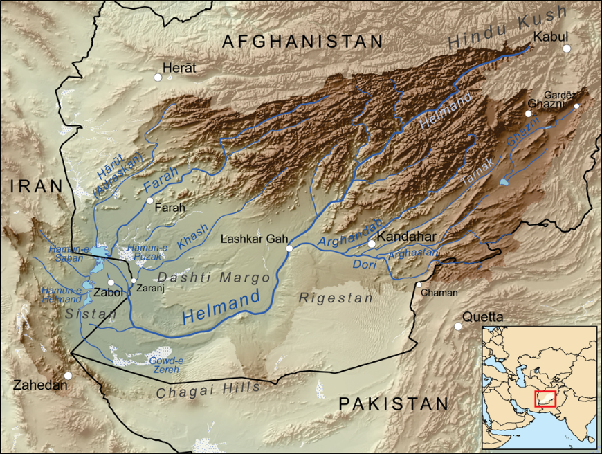

Change Detection
================================

In this section and the following sections, we will focus on polishing the skills that you acquired in the previous exercises. For this, we will focus on how to apply GIS and Remote sension for specific application cases. Such cases will demand the integration of several data sources, and the application of both Remote Sensing techniques and Spatial Data Analysis.
 
In this first exercise, we will focuse on how to integrate data for the purpose of |ltb| `<Change detection>`_.

The Sistan Basin
----------------

In this exercise, you will work with maps from the Sistan Basin; a wetland area on the borders of Iran and Afghanistan. The watershed consists of a system of rivers that flow from the Hindu Kush Mountains in Afghanistan through freshwater lakes, and then a saline depression in Afghanistan. The final destination of the rivers.  See :numref:`fig-sistan-basin` 

.. _fig-sistan-basin:

   The Sistan basin in Afghanistan and Iran

The lowest parts of the basin are covered by wetlands. The wetlands cover about :math:`4500 \ km^2`, which is one of the driest regions in the world, and it suffers from prolonged droughts. 
The droughts endanger the livelihood of about half a million inhabitants including fishermen, farmers, and others. The monitoring of the water and vegetation is of prime important, in such wetlands [CT12020]_.

.. [CT12020] Wikipedia contributors. (2020, September 14). Sistan Basin. In Wikipedia, The Free Encyclopedia. Retrieved 12:08, October 5, 2020, from https://en.wikipedia.org/w/index.php?title=Sistan_Basin&oldid=978368838

.. note:: 
   **Reflection.**
   Read the report `Monitoring Environmental Change in the Sistan Basin <sistan-report>`_. This is an optional actrivity, by it will give you a broader scope of the and detailed context of the case study related with this exercise.

Task 
   Make sure you have the **Value Tool** and  the **Temporal/spectral profile** plugins installed. 

Task 1.2 
   Configure QGIS to render layers multiple CPU cores. Go to 
   :guilabel:`Settings` > :guilabel:`Options` > :guilabel:`Rendering` and make sure the option *Render Layers in parallel using many CPU cores* in on. Set :guilabel:`Max Cores` to the number of CPU cores in your computer, use at least 4 for better performance. See below.

   .. image:: _static/img/qgis-rendering-options.png 
      :align: center

.. important:: 
   **Resources.**
   You will require the latest LTR version of `QGIS (A Coruna 3.10) <https://qgis.org/en/site/forusers/download.html>`_, plus the dataset `change_detection.zip <data_change_detection_>`_ which you can download from CANVAS.  When you unzip the dataset, you  will find several folders containing the following files:  [ALL IMAGES ARE IMG, QGIS WON'T BE ABLE TO READ THE REFERENCE SYSTEM CORRECTLY]:
  
      +  ``Quantifying_change`` - [NEED DESCRIPTION?]
      +  ``vegetation.img``
      +  ``wet_soil.img``
      +  ``dry_soil.img``
      +  ``water.img``
      +  ``limits.shp``
      +  ``Difference_style.qml``
      +  ``Dry_soil_sum.qml``
      +  ``Vegetation_sum.qml``
      +  ``Vegetation_sum_3D.qto3settings``	
      +  ``Water_sum.qml``
      +  ``Wet_soil_sum.qml``
      +  ``date-time.csv``
      +	``change_detection.qgis`` - a QGIS Project with pre-loaded data
   
   The spatial data for this exercise consists of four images with 37 bands. Each of the bands represents a different date of acquisition between the 2nd of January, 2005, and the 22nd of April, 2006. Each image contains an index of the presence of one of the following phenomena: *vegetation, dry soil, wet soil and water*. The pixel values range from :math:`0` to :math:`1`, and they represent the **percentage** of the area of the pixel covered by an specific phenomena (or variable). For example, a pixel value of :math:`0.37` means :math:`37\%`.
   
   The appendix :ref:`sistan-dates` contains a table with the acquicition dates of of each band. The dates are also available as a table in the *'change_detection'* project.

   

