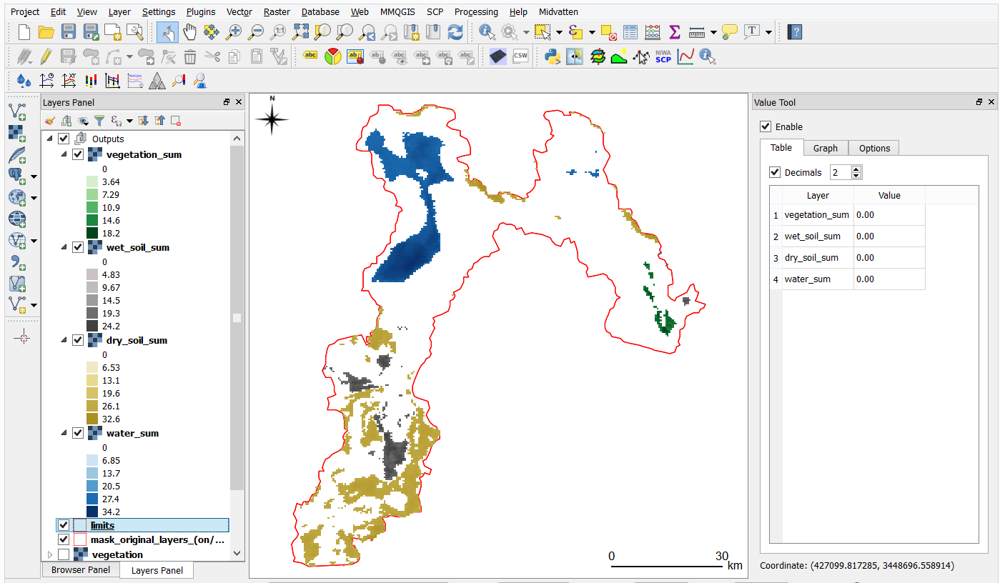
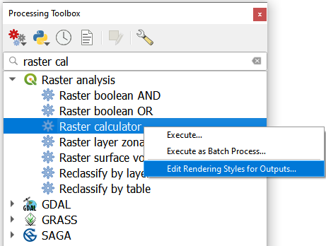

Change Detection
================================

In this section, we focus on polishing the skills that you acquired in the previous exercises. You will apply Remote Sensing to integrate data for the purpose of detecting changes of geographic phenomena. Read about it on the learning path |ltb| `Change Detection <Path Change Detection_>`_.

The Sistan Basin
----------------

In this exercise, you will work with maps from the Sistan basin; a wetland area on the borders of Iran and Afghanistan. The watersheds consists of a system of rivers that flow from the Hindu Kush Mountains in Afghanistan through freshwater lakes, and then a saline depression in Afghanistan; the final destination of the rivers.  See :numref:`fig-sistan-basin` 

.. _fig-sistan-basin:

   The Sistan basin in Afghanistan and Iran

The lowest parts of the basin are covered by wetlands. The wetlands cover about :math:`4500 \ km^2`, they are located in one of the driest regions in the world, such an area suffers from prolonged droughts. The droughts endanger the livelihood of about half a million inhabitants including fishermen, farmers, and others. Therefore,  the monitoring of the water and vegetation is of prime important in the wetlands [WC2020]_.

.. [WC2020] Wikipedia contributors. (2020, September 14). Sistan Basin. In Wikipedia, The Free Encyclopedia. Retrieved 12:08, October 5, 2020, from https://en.wikipedia.org/w/index.php?title=Sistan_Basin&oldid=978368838

.. note:: 
   **Reflection.**
   Read the report `Monitoring Environmental Change in the Sistan Basin <sistan-report>`_. This is an optional actrivity, but it will give you a broader scope of the Sistan basin, and more context of the case study related with this exercise.

.. important:: 
   **Resources.**
   You will require the latest LTR version of `QGIS (A Coruna 3.10) <https://qgis.org/en/site/forusers/download.html>`_, plus the dataset `change_detection.zip <data_change_detection_>`_ which you can download from CANVAS.  When you unzip the dataset, you  will find several folders containing the following files:  [ALL IMAGES ARE IMG, QGIS WON'T BE ABLE TO READ THE REFERENCE SYSTEM CORRECTLY]:
  
      +  ``Quantifying_change.model3`` - A model of [NEED DESCRIPTION?]
      +  ``vegetation.img`` - time series for the presence of vegetation.
      +  ``wet_soil.img`` - time series for the presence of wet soil.
      +  ``dry_soil.img``  - time series for the presence of dry soil.
      +  ``water.img`` - time series for the pressence of water.
      +  ``limits.shp`` - layer of the boundary of the Sitan basin.
      +  ``Difference_style.qml`` - QGIS style file.
      +  ``Dry_soil_sum.qml`` - QGIS style file.
      +  ``Vegetation_sum.qml`` - QGIS style file.
      +  ``Vegetation_sum_3D.qto3settings``	- [NOT USED, REMOVE?]
      +  ``Water_sum.qml`` - QGIS style file.
      +  ``Wet_soil_sum.qml`` - QGIS style file.
      +  ``date-time.csv`` -? [NEVER MENTION IN EXERCISE, ONLY IN VIDEO. IS APPEDIX ENOUGH?]
      +	``change_detection.qgis`` - a QGIS Project loaded most of the dataset listed above.
   
   The spatial data for this exercise consists of four images with 37 bands. Each of the bands represents a different date of acquisition between the 2nd of January, 2005, and the 22nd of April, 2006. Each image contains an **index of the presence** of one of the following geographic phenomena: 

   + *vegetation,*
   + *dry soil,* 
   + *wet soil, and*  
   + *water.*

   The **pixel values** range from :math:`0` to :math:`1`, and they represent the **percentage** of the area of a pixel covered by an specific geographic phenomena (or variable). For example, a pixel value of :math:`0.37` in the *'vegetation'* layer means that the pixel is :math:`37\%` covered by vegetation.
   
   The appendix :ref:`sistan-dates` contains a table with the acquicition dates of of each band. The dates are also available as a table in the *'change_detection'* project. [ASK ANDRE]

Task 1
   Make sure you have the **Value Tool** and  the **Temporal/spectral profile** plugins installed. 

Task 2
   Make sure that QGIS is cofigured to render layers  using multiple CPU cores. Go to 
   :guilabel:`Settings` > :guilabel:`Options` > :guilabel:`Rendering` and make sure the option *Render Layers in parallel using many CPU cores* in on. Set :guilabel:`Max Cores` to the number of CPU cores in your computer, use at least 4 for better performance. See below.

   .. image:: _static/img/qgis-rendering-options.png 
      :align: center

-----------------------------

Inspecting the Data
--------------------

The  *index* datasets, ``vegetation.img``, ``wet_soil.img``, ``dry_soil.img`` and ``water.img``, contain time series with 37 steps [steps= bands = TIMESTAMPS?] (each band is one step).  [THIS IS REPETITION, REMOVE?]

First you need to understand the datasets for this exercise. To do so, we will start by looking at the starting date of our change detection analysis. 

Task 3

   Open the QGIS project ``change_detection.qgis`` and make sure you have the **Value Tool** plugin visible and active.

   You will see band :math:`1` of each index images displayed as  pseudocolours. This is, the index values for the 2nd of January of 2005; the starting date of the time series. 

.. note:: 
   **Reflection.**
   For the sake of comparison, switch the layers on and off and observe the values. For example, observe how the areas with high *dry soil* values have low *wet soil* values, and vice-versa. The **Value Tool** can help in such comparisons. Do not rush this step, it is important that you understand your datasets before proceding with any analysis. Put especial attention to range of value in each layer and their spatial distribution.
   

.. note:: 
   **QGIS.**
   The Value Tool allows you to control for which bands to plot the values. Make sure you are plotting only the values for band :math:`1` in each of the images, otherwise you will be plotting values for 148 bands (:math:`4*37=148`). 

   .. image:: _static/img/valuetool-choosing-bands.png 
      :align: center

By now, you should an idea of where the  the indices of the four variables are higher or lower for  *02/01/2020*. However,  but it does not tell you if those values are equally high or low for the whole period we are analyzing. [WHAT DOES 'equally high or low'  MEANS? OVERAL MIN AND MAX?]

To have an overview over where water, vegetation, dry and wet soil tend to concentrate over time; we will aggregate the values of the 37 bands.

Task 4
Go to :guilabel:`Raster` > :guilabel:`Raster Calculator...` and **add** the 37 bands of each *index image*. Construct an *Expression* for the raster calculaor using the formula below. Give meaningful names for each output file,  for example *vegetation_sum, water_sum, etc.* See :numref:`fig-vegetation-sum` 

.. code-block:: python

   "vegetation@1" + "vegetation@2" + "vegetation@3" + ... + "vegetation@36" + "vegetation@37"

.. _fig-vegetation-sum:

   Agregation of index values using the 'Racter Calculator'

.. note:: 
   **QGIS.**
   For convenience, you can simply copy the expressions listed below to the :guilabel:`Raster Calculator Expression`.

   + *'vegetation'* image:

   .. code-block:: python
   
      "vegetation@1"+"vegetation@2"+"vegetation@3"+"vegetation@4"+"vegetation@5"+
      "vegetation@6"+"vegetation@7"+"vegetation@8"+"vegetation@9"+"vegetation@10"+
      "vegetation@11"+"vegetation@12"+"vegetation@13"+"vegetation@14"+"vegetation@15"+
      "vegetation@16"+"vegetation@17"+"vegetation@18"+"vegetation@19"+"vegetation@20"+
      "vegetation@21"+"vegetation@22"+"vegetation@23"+"vegetation@24"+"vegetation@25"+
      "vegetation@26"+"vegetation@27"+"vegetation@28"+"vegetation@29"+"vegetation@30"+
      "vegetation@31"+"vegetation@32"+"vegetation@33"+"vegetation@34"+"vegetation@35"+
      "vegetation@36"+"vegetation@37"

   + *'wet_soil'* image:

   .. code-block:: python

      "wet_soil@1"+"wet_soil@2"+"wet_soil@3"+"wet_soil@4"+"wet_soil@5"+"wet_soil@6"+
      "wet_soil@7"+"wet_soil@8"+"wet_soil@9"+"wet_soil@10"+"wet_soil@11"+"wet_soil@12"+
      "wet_soil@13"+"wet_soil@14"+"wet_soil@15"+"wet_soil@16"+"wet_soil@17"+"wet_soil@18"+
      "wet_soil@19"+"wet_soil@20"+"wet_soil@21"+"wet_soil@22"+"wet_soil@23"+"wet_soil@24"+
      "wet_soil@25"+"wet_soil@26"+"wet_soil@27"+"wet_soil@28"+"wet_soil@29"+"wet_soil@30"+
      "wet_soil@31"+"wet_soil@32"+"wet_soil@33"+"wet_soil@34"+"wet_soil@35"+"wet_soil@36"+
      "wet_soil@37"

   + *'dry_soil'* image:

   .. code-block:: python

      "dry_soil@1"+"dry_soil@2"+"dry_soil@3"+"dry_soil@4"+"dry_soil@5"+"dry_soil@6"+
      "dry_soil@7"+"dry_soil@8"+"dry_soil@9"+"dry_soil@10"+"dry_soil@11"+"dry_soil@12"+
      "dry_soil@13"+"dry_soil@14"+"dry_soil@15"+"dry_soil@16"+"dry_soil@17"+"dry_soil@18"+
      "dry_soil@19"+"dry_soil@20"+"dry_soil@21"+"dry_soil@22"+"dry_soil@23"+"dry_soil@24"+
      "dry_soil@25"+"dry_soil@26"+"dry_soil@27"+"dry_soil@28"+"dry_soil@29"+"dry_soil@30"+
      "dry_soil@31"+"dry_soil@32"+"dry_soil@33"+"dry_soil@34"+"dry_soil@35"+"dry_soil@36"+
      "dry_soil@37"

   + *'water'* image:

   .. code-block:: python

      "water@1"+"water@2"+"water@3"+"water@4"+"water@5"+"water@6"+"water@7"+"water@8"+
      "water@9"+"water@10"+"water@11"+"water@12"+"water@13"+"water@14"+"water@15"+"water@16"+
      "water@17"+"water@18"+"water@19"+"water@20"+"water@21"+"water@22"+"water@23"+"water@24"+
      "water@25"+"water@26"+"water@27"+"water@28"+"water@29"+"water@30"+"water@31"+"water@32"+
      "water@33"+"water@34"+"water@35"+"water@36"+"water@37"

.. note:: 
   **QGIS.**
   Keep your project organized. The *'change_detection'* project has a layer group named “Outputs”. Place the outputs you generate under this group or create more groups to keep the layer in your project organized. Also, keep the two vector layers always visible.

   .. image:: _static/img/keep-project-organized-changedetection.png 
      :align: center
      :width: 350px

Task 5
   Change the **Style** for each of the layer you produced in the previous task, so that you can easily visualise where the values concentrate [NOT SURE CONCENTRATE IS THE RIGHT WORK]. For the *'vegetation_sum'* layer, go 
   :guilabel:`Right-Click` > :guilabel:`Properties...` > :guilabel:`Symbology` > :guilabel:`Style` > :guilabel:`Load Style...` > search and select for the ``vegetation_sum.qml`` file > :guilabel:`Open` > :guilabel:`OK`.
   See :numref:`fig-load-style` 
   
   The styles you applied are only to facilitate a visual analysis. *All the layers are divided into* :math:`5`   *classes but only the highest* :math:`20 \%` *of values are visible.* Such values identify areas where the presence of each index (variable) accumulates over period depicted in the time series.
   
   

   [THE STYLE FILE GAVE ME SOMETHING STRANGE. CHECK?]

.. _fig-load-style:

   Apply a style to the 'vegetation_sum' layer using a style file

Task 6
   Repeat the procedure above to change the styles of *'wet_soil_sum', 'dry_soil_sum', and 'water_sum'* layers. Look for the correct style files in your data directory.
   Your project should now have the four aggregation layer properly styled. See :numref:`fig-aggregated-layers-styled` 

.. _fig-aggregated-layers-styled:

   The 'vegetation_sum', 'wet_soil_sum', 'dry_soil_sum', and 'water_sum' layers with custom styles

--------------------------

Plotting time series
--------------------

Now that you have an overview on the range and spatial distribution of value for each of the *'index'* image. We will take a look at how the values change over time.

Task 7
   Use the **Temporal/spectral Profile** plugin to inspect how the values in the  *'water;* layer change over time. Sample two or three points close to the areas where the values in the *'aggregated'* layers are the highest.
   Whatch the video tutorial on `inspecting time series <https://player.vimeo.com/video/236881857>`_.

.. raw:: html

   
<iframe src="https://player.vimeo.com/video/236881857?color=007e83&portrait=0" style="position:absolute;top:0;left:0;width:100%;height:100%;" frameborder="0" allow="autoplay; fullscreen" allowfullscreen></iframe>

\

Task 8
   Use the **Temporal/spectral Profile** plugin to  explore how the other *variables* change or compare over time. [VARIABLE=PHENOMENON=INDEX? CONFUSING]

.. attention:: 
   **Question.**
   Observe the two plots below. For each plot, **can you explain how the changes in each** *variable* **are related?**

   .. image:: _static/img/change-plot-a.png 
      :align: center
   
   \

   .. image:: _static/img/change-plot-b.png 
      :align: center

-------------------------

Quantifying differences
------------------------

You have now a better understanding of the data in this exercise, i.e., what it represents and its ranges and limits. In this part, we will conduct an analysis to quantify the changes in each *'index'* layer.

Increase and Decrease in Water
^^^^^^^^^^^^^^^^^^^^^^^^^^^^^^^^^^^^^^^^^^

In this part of the exercise, we will look at how  the water values increase or decrease between dates. This variable is very important because its behaviour influence the other three variables.

Task 9
   From the :guilabel:`Processing Toolbox`, :guilabel:`Right-click` on the tool **Raster calculator** > :guilabel:`Edit Rendering Styles for Outputs...`. See :numref:`fig-edit-rendering-styles` :guilabel:`Click` the elipses (``...``) > select the ``Difference_style.qml`` file > :guilabel:`Open` > :guilabel:`OK`.

.. _fig-edit-rendering-styles:

   The 'Raster calculator' in the Processing Toolbox 

.. note:: 
   **QGIS.**
   In the following tasks, you will use the **Raster calculator** to generate layers that compute the difference between two adquisition dates. Setting the tools to use the same style to  render the output layers will make easier to compare and understand the results, and it will you save time. 

Task 10
  Use the **Raster calculator** in the *Processing Toolbox* to compute the difference between **band** :math:`8`  (21/04/2005) and **band** :math:`12`  (22/06/2005) from the *'water'* layer. Use the following formula to compute the difference map:
  
   .. math::

      \Delta_{map} = Map_{(final \ state)} - Map_{(initial \ state)}

\

   Do not forget to set the :guilabel:`Reference layer(s)` parameter to  the *'water'* layer, :numref:`fig-calculating-difference` 

.. _fig-calculating-difference:

   Computing a difference map between bands of the 'water' layer

.. attention:: 
   **Question.**
   Look closely at map resuling from the previous task. See below. **What do the values of the difference map mean?**

   .. image:: _static/img/difference-water.png 
      :align: center

Task 11
   Repeat the procedure described in the previous task. This time compute the difference between **band** :math:`8`  (21/04/2005) and **band** :math:`20`  (12/09/2005) from the *'water'* layer.

.. attention:: 
   **Question.**
   Look closely at difference maps from the previous tasks. **What changes occurred between the 21st of April and the 12th of September of 2005?**

Detecting Changes in Water
^^^^^^^^^^^^^^^^^^^^^^^^^^^^

In the last part of this exercise, we will assess how the values change globally in the study area over a period of 10 months. From January to October 2005.
For this analysis, *we consider the percentage of the total area of the basin covered by water*. Earlier in the exercise, we explained that the *index* (:math:`0 \ to \ 1`) 
represent the percentage of the area of a pixel covered by an specific geographic phenomena, in this case *water*.
Therefore, the *total percentage of area covered by water* in a band :math:`T_{water}`,  can be computed using the following equation:

.. math::

   T_{water} = \frac{B \times 100}{A}

Where :math:`A`  is the total number of pixels in a band, and :math:`B` is the sum of the pixel values in that same band. The constant :math:`100` converts the values to percentage.

This analysis requires apply the equation above :math:`10` times (one for each month in the analysis), according to the table below.

===================    ================     ================
Band (water layer)      Date (Y-M-D)         Date (M-Y)
===================    ================     ================
1	                     05-01-02             Jan-05
3	                     05-02-21            Feb-05
4	                     05-03-12            Mar-05
7	                     05-04-03            Apr-05
10	                     05-05-22            May-05
11	                     05-06-13            Jun-05
13	                     05-07-08            Jul-05
16	                     05-08-09            Aug-05
19	                     05-09-03            Sep-05
23	                     05-10-01            Oct-05
===================    ================     ================

Instead of repeting the procedure to compute :math:`T_{water}` ten time, you will use predefined QGIS model which automate such a task.

[UP TO THIS POINT THE SECTIONS AND TASKS SEEMS DESCONNECTED, AND THE OVERAL OBJECTIVE OF THE analysis IS DOUBTFUL]

Task 12
   Go to :guilabel:`Processing Toolbox` > :guilabel:`Models` >  :guilabel:`Add Model to Toolbox..`. See :numref:`fig-load-model` . Select the model ``quantifying_change.model3``.

.. _fig-load-model:

   Add model to 'Processing Toolbox'

Task 13
   Us the model you just add to the **Processing Tooolbox** to compute :math:`T_{water}` for the bands listed in the table above. Go to :guilabel:`Processing Toolbox` > :guilabel:`Moderls` > :guilabel:`quantifying_changes`, :numref:`fig-quantifying-change` . Double click on the model to open the model. For :guilabel:`Extent` and :guilabel:`Indicator`, select the *'water'* layer. Click :guilabel:`Run` 

.. _fig-quantifying-change:

   The model 'quantifying changes' in the Processing Toolbox

Task 14
   Use the **Temporal/Spectral Profile** plugin to inspect the values of the band stack created by the model, :numref:`fig-profile-quantifying-change`  Refere to Task  8 if you need to.

.. _fig-profile-quantifying-change:

   Exploring the values of 'total percentage of area covered by water' with the 'Temporal/Spectral Profile' tool

.. note:: 
   **QGIS.**
   QGIS will not preserve the original number of the bands in the output band stack. This means that you have to keep track of which band in the output stack corresponds to the bands in the original dataset. In this case, they correspond as following:

   =================    ========================      ==========
   Original Band No.    Band No. in Output Stack      Month
   =================    ========================      ==========
   1                    1                             January
   3	                  2	                           February
   4	                  3	                           March
   7                    4                             April
   10                   5                             May
   11	                  6                             June
   13	                  7                             July
   16	                  8	                           August
   19	                  9	                           September
   23	                  10	                           October
   =================    ========================      ==========

.. attention:: 
   **Question.**
   Look at the line plot in the **Temporal/Spectral Profile**  tool. What does the profile curve show? How do we interprete the values?

Task 15
   Repeat Tasks 13 and 14 using another variable, for example *vegetation*. Plot the profile curves in the **Temporal/Spectral Profile** plugin. Write down your observations and take them to the virtual classroom.

