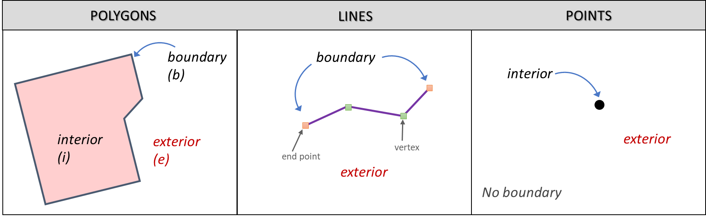

Spatial Data Models
===================

Geographic Phenomena
--------------------

.. admonition:: Resources

   This exercise requires no software or auxiliary datasets. 

Geographic Phenomena is a term for all phenomena with a spatial dimension, such as landcover or air pollution. Phenomena are geo-graphic (spatial) when they: 

* Can be named or described; 
* Can be georeferenced (have a location on the Earth’s surface); 
* Can be assigned a time interval. 

Geographic Phenomena can be divided into  Geographic Objects  and Geographic Fields, and  Geographic Fields can represent geographic phenomena as discrete fields or continuous fields.

.. attention:: 
   **Discussion.**
   Give some examples of phenomena for which one of the three elements above is missing. Can they be used in a GIS? 
 
.. admonition:: LTB

  Lean about:
  `Geographic phenomena. <https://ltb.itc.utwente.nl/page/179/concept/11894>`_
  `Geographic field <https://ltb.itc.utwente.nl/page/179/concept/11833>`_
  `Geographic object <https://ltb.itc.utwente.nl/page/179/concept/11801>`_

Objects or Fields
^^^^^^^^^^^^^^^^^

Task
    Complete the table below by indicating if the phenomenon on the left is an object or field, and if it is discrete or continuous.

    +---------------------+------------------+-------------------------+
    | Phenomena           | Field of Object  | Discrete or Continuous  |
    +=====================+==================+=========================+
    | Wind direction      | \                |    \                    |
    +---------------------+------------------+-------------------------+
    | Temperature         | \                |             \           |
    +---------------------+------------------+-------------------------+
    |  Roads              | \                |    \                    |
    +---------------------+------------------+-------------------------+
    | Buildings           | \                |    \                    |
    +---------------------+------------------+-------------------------+
    | Field sample points | \                |    \                    | 
    +---------------------+------------------+-------------------------+
    | Landuse             | \                |    \                    |
    +---------------------+------------------+-------------------------+
    | Soil Type           | \                |    \                    |
    +---------------------+------------------+-------------------------+

Object's Parameters
^^^^^^^^^^^^^^^^^^^

Task
    Which locational parameters can be used to describe objects? Not all the parameters that you identified are essential for all objects.  
    Which of the locational parameters are important for the objects below? 

    +---------------------+----------------+---------------+----------------+--------------+
    | Object              | Parameter 1    | Parameter 2   | Parameter 3    |  Parameter n |
    +=====================+================+===============+================+==============+
    | House               | \              | \             |  \             |  \           |
    +---------------------+----------------+---------------+----------------+--------------+
    | Road                | \              | \             |  \             |  \           |
    +---------------------+----------------+---------------+----------------+--------------+
    |  Well               | \              | \             |  \             |  \           |
    +---------------------+----------------+---------------+----------------+--------------+
    |  Lakes              | \              | \             |  \             |  \           |
    +---------------------+----------------+---------------+----------------+--------------+
    | Rivers              | \              | \             |  \             |  \           |
    +---------------------+----------------+---------------+----------------+--------------+

Crispy or Fuzzy Boundaries
^^^^^^^^^^^^^^^^^^^^^^^^^^
  
Another notion that is important for describing Geographic Phenomena are boundaries. We distinguish two types of boundaries: Crisp and Fuzzy.  

.. attention:: 
   **Discussion.**
   Give one example of a crisp boundary and one of a fuzzy boundary for any geographic phenomena. 

.. admonition:: LTB

   Learn about: 
   `Boundaries. <https://ltb.itc.utwente.nl/page/179/concept/11799>`_

Autocorrelation 
^^^^^^^^^^^^^^^
There is one more concept that requires an introduction at this point, and that is spatial autocorrelation. Spatial autocorrelation is based on Tobler’s first law of geography.

Task
    Define in your own words what spatial autocorrelation is. 

Although all computer representations store data as finite representations, it is important that you realise that some phenomena show autocorrelation. 

.. attention:: 
   **Discussion.**
   Give one example of a crisp boundary and one of a fuzzy boundary for any geographic phenomena. 

.. admonition:: LTB
   Learn about: 
   `Spatial autocorrelation. <https://ltb.itc.utwente.nl/page/179/concept/11921>`_

Computer representations 
------------------------

The previous exercise did not contain any software tasks. This should not have surprised you because the folcus of that exercise was to understand  geographic phenomena and their characteristics, and not to show the way we  represent phenomena.  In this exercise we will focus on the latter. However, a good understanding of geographic phenomena will help you in choosing a suitable computer representation.  

In this exercise, you will explore  different types of computer representations for geographic phenomena available in a  GIS,  and how to select the most suitable computer representation for a specific phenomenon.   

To get an overview of the different ways we can store geographic phenomena in a GIS, we are going to use the concept map of your Living textbook. 

.. attention:: 
   **Discussion.**
   Look for the term “Geographical Representation” in the Living textbook, and explore all related concepts two links apart. Make a screendump of the concept map showing your result and upload it to the discussion board. How many different types of representations of spatial data did you find? 
   

.. admonition:: Resources

   You will require the latest LTR version of `QGIS (A Coruna 3.10) <https://qgis.org/en/site/forusers/download.html>`_, plus the dataset **data_modelling.zip** which you can download from CANVAS.  When you unzip the dataset, you will find the following files inside it: 
  
   + **Cities.csv** – a comma-separated values file with city names; 

   + **Spatial_data_modelling.qgs** – A QGIS project preloaded with datasets 

   + **elevation.tif** – a digital elevation model; 

   + **points.gpkg** – a vector dataset representing elevation points. 

Tesselations 
^^^^^^^^^^^^

Tessellations are a way to represent geographic phenomena in a GIS. A tessellation splits the geographic space in small cells in such a way that the complete area is covered by them. They are like tiles on a floor or a wall. In most cases such tiles are square cells and when all cells are equal in size, we call this a regular tessellation. 

In a regular tessellation each cell is associated to a value (cell value). This value has a data type, such as integer or floating-point. 

An integer datatype is a number that does not contain any decimals. They are often used to indicate codes in a discrete field (e.g. a landuse class). A float or floating-point datatype is a number  that may contain decimals. A floating-point data type that can store very big numbers (64bit) is  known to have ‘double precision’ and it is oftencalled “Double”. The table below shows a list of very common data types used in a GIS. 

===============   =============================================================
 SHORT INTEGER    Numeric values without decimals within a specific range. 
                  
                  Application: store coded values. 
 LONG INTEGER     Numeric values without decimals within a specific range. 
                  
                  The range is larger than a short integer. 
 FLOAT            Numeric values with decimals within a specific range. 
                  
                  Single precision (32bits). 
 DOUBLE           Numeric values with decimal within a specific range. 
                  
                  Double precision (64bits). 
 TEXT             Names or other textual qualities. 
 DATE             Dates and/or times. 
===============   =============================================================

Task 2.1 
   What data type would you use to represent a discrete field when you store it as a tessellation? And for a continuous field? 

Task 2.2 
   Boundaries in raster layers are both artificial and fixed. This has  advantages and  disadvantages. Can you give some examples of the advantages and disadvantages of artificial and fixed boundaries in raster layers?

Task 2.3 
   Open the ’spatial_data_modelling’ QGIS project we provided in thedataset, and explore the properties of the tessellation representing elevation (elevation.tif)

   How many rows/columns do the elevation.tif data has?. Are the values  o type integer or floating point? What are the minimum and maximum values? 

   (Hint: from the layers panel, right click on the layer to access its properties. Once in the properties dialog look into the ‘Information’ dialog.) 

.. attention:: 
   **Discussion.**
   What is the difference between a raster and a grid?    

There are also have Irregular tessellations. In irregular tessellations a geographic area is partitioned into cells which are **not equal in size.** 

.. attention:: 
   **Discussion.**
   It is often stated that irregular tessellations are more adaptive compared to regular tessellations. What exactly is meant by this?
   
.. admonition:: LTB

   Learn about:
   `Regular tesselation. <https://ltb.itc.utwente.nl/page/179/concept/11835>`_
   `Irregular tesselation. <https://ltb.itc.utwente.nl/page/179/concept/11926>`_

Task 2.4 
   Although there are multiple examples of irregular tessellations, you only have to study one example: “the Quadtree”. When you are not familiar with Quadtrees yet, refer to your Living Textbook for more information. The best way to learn how Quadtrees work is to manually construct one. 

   Construct the Quadtree for the raster layer shown below. Upload a picture of your Quadtree in the discussion board. 

   .. image:: _static/img/quad-tree.png 

.. admonition:: Question

   Using a Quadtree to represent a geographic phenomenon improves computation performance (computations are faster). Do you understand how this works?

Task 2.5 
   Calculate the area of the green, blue and white cells in the Quadtree above using the levels of the regions Quadtree.

Vector Data Model 
^^^^^^^^^^^^^^^^^
The main difference between our first data model (tessellation) and the vector data model is that tessellations do not explicitly store the geo-reference of the phenomena, but the vector data model does. This means that with every feature, coordinates are stored. In this section we will discuss four examples of vector data representations: Triangulated Irregular Networks (TIN), Polygons, Lines and Points. 

We start with the Triangulated Irregular Networks (TINs) because they have some characteristics in common with tessellations. 

.. admonition:: Question

   Which characteristics have in common TINs and tessellations?

 Task 2.6 
   From the picture below, manually create a TIN from the given input points.

**picture goes here**

.. attention:: 
   **Discussion.**
   Take a picture of your Triangulation and upload it in the discussion board to compare your result with the results of your classmates. How many different solutions are there?

.. admonition:: Question

   You may be surprised but not all triangulations are equally good. The standard triangulation is a Delaunay triangulation. Was your triangulation Delaunay? 

Task 2.7 
   In your QGIS project you find a layer with points. Generate a Delaunay triangulation and compare the result with the tessellation you made.    

**picture goes here**

A triangulation can also be used to generate a continuous tessellated surface by means of interpolation. In those cases, each cell is assigned the value that is related to how far that cell is from the anchor points. 

.. admonition:: LTB

   Learn about: 
   `TINs <https://ltb.itc.utwente.nl/page/179/concept/12038>`_

Task 2.8 
   Create a tessellation using the TIN interpolation tool using as input the anchor points you have in your QGIS project. Then, use the Identify tool to inspect the cell values. 

**picture goes here**

.. important:: 
   **QGIS.**
   QGIS does not perform ‘on the fly interpolation’ – meaning that any point you click within your interpolated surface will have its value calculated on the spot. Instead what QGIS does is to generate a tessellation of predefined cell size where each cell as a fixed value. ‘On the fly’ interpolations are supported in ArcGiS, for example, however it is a functionality that will only exist within ArcGIS – the resulting data structure cannot be exported and used in other software packages.

We can, however, explore the concept of ‘on the fly interpolation with a simple paper and pencil exercise. 

Task 2.9 
   Place a point on the TIN (on one of the triangles) below and manually calculate the value at this point. What you are performing is and “On the Fly Interpolation”. 

   **picture goes here**

   The best way of doing this is to draw a line through one of your anchor points and the point you selected. You first identify the value at which the line crosses the edge of your triangle. You can do this by measuring along the edge.  

   **picture goes here**

.. attention:: 
   **Discussion.**
   What exactly are the advantages of a TIN over a tessellation?  

Task 2.10 
   In your data you find a table Cities2.csv. Try to use this table to create a point layer in QGIS. Start a new QGIS project and add the layer to QGIS using the “Delimited Text” option. 

   **picture goes here**

From the previous task you should have become clear that **points** are the simplest of geometries – they have an Y and X coordinates that anchors them to the spatial frame you are working on. 

Another way of representing geographic phenomenon suing the vector data model is using  **lines**. A line is nothing more than two or more connected points.  

.. attention:: 
   **Discussion.**
   What is the difference between nodes and vertices and how can we know the direction of a line? 

A last type of vector data model is  **polygons**. Polygons are one of the most well-known and commonly used vector data models. The are two important parts when using a polygon data model: the boundary model and the Topological model.  

The boundary model explains how areas are represented and by storing the closed boundary that defines an area. A closed boundary is defined by a closed line (consisting of nodes and vertices, where the start and end vertices intersect). When representing the footprints of houses or the borders between countries, the boundary of each feature (house/country) is stored individually. 

The Topological model is discussed in the next section of this exercise. (page: Polygon[add internal reference]) 

Task 2.11 
   Describe in your own words the problems that may arise when using the boundary model without topology. 

.. admonition:: LTB

   Learn about: 
   `Line representation. <https://ltb.itc.utwente.nl/page/179/concept/11777>`_
   `Area representation. <https://ltb.itc.utwente.nl/page/179/concept/11980>`_

Topology 
^^^^^^^^

The third topic in this exercise is topology. You will first have to understand what topology is before learning different ways to use it. Topological properties are geometric properties and spatial relations that are not affected by the continuous change of shape and size  of a vector data layer (points, lines, or polygons).   

Task 3.1 
   Imagine you are looking at a map (take any map you like). Make a small list containing at least five examples of spatial topology that are visible in your map and five examples of properties that are not topological (use the table below).

   ===============  ===============  ==================
   Example             Topological     Non-topological 
   ===============  ===============  ==================                 
   1                 \                  \                           
   2                 \                  \
   3                 \                  \
   4                 \                  \
   5                 \                  \
   ===============  ===============  ==================

When looking at two polygons, we can  define all their possible topological relationships. To do so, we must describe each polygon in terms of its boundary and its interior (area inside  the boundary). 

   The boundary, interior and exterior of polygons, lines and points.

.. attention:: 
   **Discussion.**
   What is the correct mathematical (set theory) expression that describes the covers relationship? How does this expression differ from the covered by relationship?

By now, you should understand what topology is, but you may wonder how it can be used. During the coming exercises you will see many different uses, but for now focus on a example given in  the  Topological Data Model

.. attention:: 
   **Discussion.**
   You are going to draw a map and the corresponding attribute table, following the topological data structure. The map below shows a polygon layer based on administrative units  (municipalities). Focus your attention on the **Geldrop-Mierlo** municipality and its adjacent municipalities. The table below shows as example the topological data structure for Geldrop-Mierlo. 

   .. image:: _static/img/geldrop-mierlo.png
      :align: center
   
   \

   .. image:: _static/img/geldrop-table.png
      :align: center

.. admonition:: LTB

   Learn about:
   `Topological relationship. <https://ltb.itc.utwente.nl/page/179/concept/12044>`_
   `Topological data model. <https://ltb.itc.utwente.nl/page/179/concept/11802>`_
   `Topological consistency. <https://ltb.itc.utwente.nl/page/179/concept/12043>`_
  

Task 3.2 
   Identify for every example below which rule of topological consistency is violated. 

   ====================================================  =========
   Example                                               Rule(s) 
   ====================================================  =========
   The boundary of a polygon is not closed.              \
   Two lines cross each other without an intersection.   \
   There is a gap between two polygons.                  \
   Two polygons overlap.                                 \
   ====================================================  =========

   *Additional uses of topology will be discussed in the sections: Data Entry, Queries and Networks. Note: Topology is only required at the conceptual level (no practical component)*

.. attention:: 
   **Discussion.**
   The following statements are made about time. What is your opinion on them? Are they true or false?

Temporal Dimension 
^^^^^^^^^^^^^^^^^^

In many situations it is not enough to describe geographic phenomena only in terms of  space, but also in terms of time because such phenomena change over time. The change may be relatively fast (like the clouds in the sky, hurricanes, and traffic) or slow (like the movement of glacier). 

To represent time when modelling spatial data, we define different types of change:  change in attributes, change in location (movement) and change in shape (growth) or combinations of these three. 

Task 4.1 
   Below you see a list of different types of change and some combinations. Can you write down an example for each type? 

   =============================   ========
   Type of Change                  Examples
   =============================   ========
   Attribute                           \
   Attribute and Location              \
   Attribute and Shape                 \
   Location                            \
   Location and Shape                  \
   Attribute, Location and Shape       \
   =============================   ========

.. attention:: 
   **Discussion.**
   The following statements are made about time. What is your opinion on them? Are they true or false? 

   + Although time is continuous in nature, in a GIS it is always represented in a discrete manner. 
   + There are many examples of spatial phenomena for which valid time is simply unknown. 
   + Branching time should be looked at into the future, as the past is already known and has only one branch. 
   + Time granularity is comparable to the spatial concept of resolution. 

.. admonition:: LTB

   Learn about: 
   `Spatial-temporal data model . <https://ltb.itc.utwente.nl/page/179/concept/12018>`_

Reflection
^^^^^^^^^^

.. admonition:: Question

   1. So far, you used vector representation of area features stored as Shapefiles. Are these shapefiles storing topology? In other words, do Shapefiles use a topological data model? 

   2. In this exercise we have mainly focussed on 2-D data modelling examples. Yet, the real world is 3D. Do you know any examples in which a real 3-D data model would be needed? Is there also a 3-D topology? 

   3. Which other compression techniques exist besides Quad trees? 
   
   4. Besides rectangular cells, other shapes can be used. What is the advantages of using Hexagonal cells? 
   
   5. Make a comparison between raster and vector data models and list the advantages and disadvantages of each one. 
