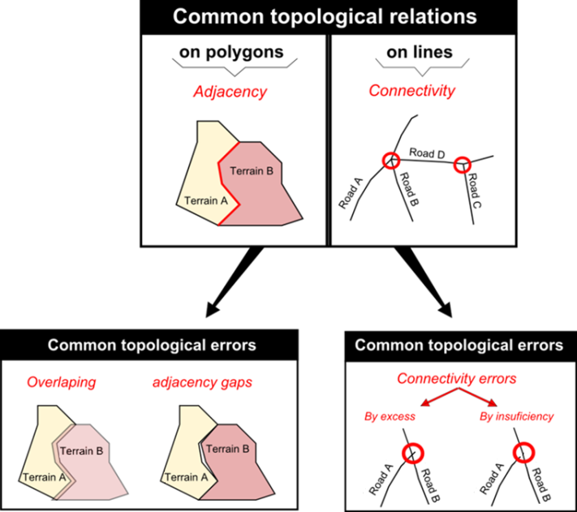

Databases: Data Entry
=====================

Direct (or primary) spatial data acquisition 
--------------------------------------------

.. admonition:: Resources

   This exercise requires no data and no specific software. 

Spatial data can be obtained from several sources  There has been an increase of data acquired (or produced) using remote sensed sources, such as satellite imagery. 

Other sources of spatial data include aerial photographs, traditional surveying and crowdsourcing. Different spatial data sources imply that what can be expected depends on the strengths and weaknesses of each particular source and associated acquisition methods. 

.. attention:: 
   **Discussion.**
   Fill in the table below entering at least one possible advantage and one possible disadvantage for each data source.

    ==================      =========   ============
    Data Source             Advantage   Disadvantage 
    ==================      =========   ============
    Remote sensing          \           \
    Aerial survey [#]_      \           \
    Terrestrial survey      \           \
    Crowdsourcing           \           \
    ==================      =========   ============

    .. [#] It should be noted that aerial surveys are a form of remote sensing, but not from space. 

.. admonition:: LTB

   Learn about: 
   `Spatial data acquisition. <https://ltb.itc.utwente.nl/page/179/concept/11776>`_
   `Remote sensing. <https://ltb.itc.utwente.nl/page/179/concept/12002>`_
   `Aerial survey. <https://ltb.itc.utwente.nl/page/179/concept/12084>`_
   `Terrestrial survey. <https://ltb.itc.utwente.nl/page/179/concept/11888>`_
   `Crowdsourcing. <https://ltb.itc.utwente.nl/page/179/concept/11847>`_

Indirect (or secondary) spatial data acquisition 
------------------------------------------------

Although spatial data can be acquired from third-party sources like government agencies or specialized companies. There will always be the need to acquire your own data. This usually means ‘digitizing’ also known as ‘vectorization’ – the process of capturing objects from a raster base layer like a map or an aerial photograph as points, lines and polygons . In this section, we will cover the main techniques used for vectorization. 

.. admonition:: Question

   Observe the relation between **Digitizing** and **Scanning**. Is Digitizing the only way to turn a scanning into Spatial data?

.. admonition:: LTB

   Learn about: 
   `Digitizing. <https://ltb.itc.utwente.nl/page/179/concept/11865>`_
   `Scanning. <https://ltb.itc.utwente.nl/page/179/concept/12006>`_

.. admonition:: Resources

   You will require the latest LTR version of `QGIS (A Coruna 3.10) <https://qgis.org/en/site/forusers/download.html>`_, plus the dataset **data_entry.zip** which you can download from CANVAS.  When you unzip the dataset, you will find the following files inside it: 

   + **data_entry.qgs** – a QGIS project file; 
   + **checking_errors.qgs** – a QGIS project file; 
   + **Pearl_Harbour_topographic_map_(1999).tif** – a raster map; 
   + **Educational_facilities.csv** – tabular data; 
   + **Polygons.gpk** – a polygon vector layer. 
   
Digitizing 
^^^^^^^^^^

Extracting the data you need from a raster base map to a vector layer starts with creating a new dataset (i.e. layer), where the features that are about to be created will be stored. Technically speaking, it is a simple task however you should always take a moment to assess the requirements before proceeding with the actual software operation. 

Capturing elements from a base map is an abstraction exercise; this abstraction depends on the scale and purpose for which the data will be used. For example, think of airports; will you represent them (abstract them) as points or as polygons? The answer to this question will depend on how you are going to use the data. If you want to publish a world map of the major airports, probably you can depict them as points, but if you want to map the accessibilities to a given airport, a larger scale will be needed; therefore polygons might be better.  

The attributes associated with the geometries are another important aspect to consider. The choice of attributes depends on not only the scale and intended use but also of the availability of the data (e.g. what is the capacity of the airport? How does it rank on security? How many international connections does it serve? – would these be information you need to have? And if so, do you have access to this data?) 

.. admonition:: LTB

   Learn about: 
   `Associating attributes. <https://ltb.itc.utwente.nl/page/179/concept/12094>`_

Task 2.1 
    Start QGIS and open the *data_entry.qgs project*. Among others, you will see a layer named *Pearl_Harbour_topographic_map_(1999).tif* Observe the map and complete the table below considering the following requirements: 

    + Think of at least three vector layers that can be acquired from the raster base map;  
    + Make sure all geometric types – Polygon, Line, Point are represented;  
    + For each layer think of at least two attributes. 

    ===========     ===============   ===========     ===========
    LayerName       Geometric Type    Attribute 1     Attribute 2 
    ===========     ===============   ===========     ===========
    water_lines     line                Id              length 
    \               \                   \               \
    \               \                   \               \
    \               \                   \               \
    \               \                   \               \
    \               \                   \               \
    \               \                   \               \
    ===========     ===============   ===========     ===========

 Task 2.2 
    Now that you know what you want to extract and how are you are going to abstract it, proceed with the creation of the new layers. Digitize at least three features per layer. 

    *For this task,you may want to watch this video tutorial.*

    .. raw:: html

       <iframe width="560" height="315" 
       src="https://vod-progressive.akamaized.net/exp=1594222834~acl=%2A%2F1225616998.mp4%2A~hmac=65a57eed898aa979138279196902179be97313024302863813dc3d23ffaa7526/vimeo-prod-skyfire-std-us/01/3345/12/316725601/1225616998.mp4?
       filename=Basic_Digitizing.mp4" frameborder="1em" 
       title="Basic Digitizing" 
       allowfullscreen></iframe>

.. important:: 
   **QGIS.**
   Refer to `Editing <https://docs.qgis.org/3.10/en/docs/user_manual/working_with_vector/editing_geometry_attributes.html>`_ for a detailed description of vector editing with QGIS.

Topology 
^^^^^^^^

Topology can be a complex subject but we will take a very pragmatic approach and show you how to maintain the most common topological relations – adjacency in polygons and connectivity of lines –.  

   Common topological relations on polygons, lines, and points.

In the previous task, for the layer of geometry type ‘Line’ you probably digitized something that is supposed to be a network like roads or water lines. The key characteristic of a network is *connectivity*, however if you happen to have digitized lines that are supposed to be connected and you zoom in to the point where the intersection is supposed to be, you will see that lines are not connected. Instead, you will see connectivity issues either by excess or by insufficiency (also known as *overshoots* and *undershoots* respectively). 

.. figure:: _static/img/under-shoot.png
   :alt: undershoot
   :figclass: align-center

   Connectivity issues between lines. The case of undershoot.

To ensure that line segments get connected while digitizing, we have to set a snapping tolerance, which tells the GIS software to automatically connect lines that are within certain distance. Otherwise, it will be very difficult to ensure that our lines are connected.  

.. admonition:: LTB

   Learn about: 
   `Topology. <https://ltb.itc.utwente.nl/page/179/concept/12045>`_
   `Topology consistency. <https://ltb.itc.utwente.nl/page/179/concept/12043>`_
   `Topological data model. <https://ltb.itc.utwente.nl/page/179/concept/11802>`_
   `Topological relationship. <https://ltb.itc.utwente.nl/page/179/concept/12044>`_

Task 2.3  
    In QGIS, go to Project > Snapping Options  and enable Snapping mode. Enter a tolerance of 20px for every layer of lines that you may have. Refer to ‘Topological editing’ 

    *For this task,you may want to watch this video tutorial.*

    .. raw:: html

       <iframe width="560" height="315" 
       src="https://vod-progressive.akamaized.net/exp=1594226749~acl=%2A%2F1225616990.mp4%2A~hmac=49af46081efd37aee1a76417125f5b9a064581a8da069442d000d39104587cbd/vimeo-prod-skyfire-std-us/01/3345/12/316725579/1225616990.mp4?filename=Advanced_Digitizing.mp4" frameborder="1em" 
       title="Advance editing" 
       allowfullscreen></iframe>

Task 2.4  
    Digitize some new lines making sure they are topologically connected.  You will notice that, while digitizing, if you go closer than a certain distance of an existing feature the line will be automatically ‘pulled’ towards the nearest vertex or segment of the closest feature thus ensuring connectivity. 

    In the case of polygons it is also possible to ensure that adjacent polygons do not overlap. 

snapping tolerance? What do the options ‘Enable topological editing’ and  ‘Enable snapping on intersection’ allow you to do? Try to think of situations where these options might be useful. 

 
.. important:: 
    **Reflection.**
    Ensuring the topological consistency of your vector data is usually not that difficult if you are in control of the data acquisition technique (vectorization) from the moment the dataset is created. Problems often arise when you receive datasets from third parties. When that happens you should always do check to make sure the dataset maintain the basic topological relations. 

Task 2.5  
    Start QGIS and open the *checking_errors.qgs* project. You will see one layer (polygons). Find a way to automatically check if there are overlapping or adjacency errors. Tip: you may want to install and activate the **Geometry Checker** plugin. Once it is activated,  it should be reachable from the Vector menu.

    .. image:: _static/img/geometry-checker.png

In some cases detecting and fixing topological errors is not that simple. Just keep in mind you should always check the integrity of the data you receive, especially if you do not know the source and lineage of the data.  

Spatialising data
^^^^^^^^^^^^^^^^^ 

Another way to acquire spatial data is by means of spatialising data. In other words associate a geographic location with objects. This is a very common procedure when you get for example a spreadsheet or some sort of tabular data. 
 
You can spatialise your data in two ways. By means of a *join* (a concept that will be explored later ahead in the course), or by means of building point geometries given that the tabular data contains X and Y coordinates.  

Task 2.6 
    Spatialising data. Open the *data_entry.qgs* project and create a point layer using the *educational_facilities.csv* file. Follow the steps  depicted in the screenshot below.

    .. image:: _static/img/spacialising.png

.. attention:: 
    **Discussion.**
    If all went well you should have ended up with a layer of points in your project. Does that mean that the *educational_facilities.csv* is spatial data?

**ADD reference to appendix**
