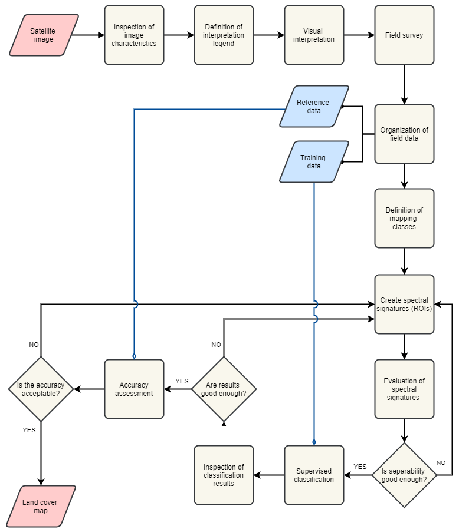

Digital Image Classification
============================

In this exercise, we use a **Sentinel-2** satellite image covering Enschede and its surroundings from September, 2016. Before going forward with the exercise read about |ltb| `<Digital Image Classification_>`_.

.. important:: 
   **Resources.**
   You will require the latest LTR version of `QGIS (A Coruna 3.10) <https://qgis.org/en/site/forusers/download.html>`_, plus the dataset `digital_image_classification.zip <data_digital_image_classfication_>`_ which you can download from CANVAS.  When you unzip the dataset, you will find the following files inside: 
  
   + ``s2_25_sept_2016.tif``, a Sentinel-2 satellite image of Enschede.
   + ``Training_areas.shp``, containing the sites visited during a fieldwork.
   + ``digital_image_classification.qgs``, a project containing the files above.
   + ``Field_Photos_201``, a folder containing photos of the surroundings of training areas.

The methodology for mapping land cover  using satellite images consist of the following steps:

1.	Interpretation of satellite image 
2.	Field data collection
3.	Field data analysis
4.	Supervised Classification
5.	Accuracy assessment

In this exercise, you will conduct the steps mentioned above except for **Field data collection**. The workflow in :numref:`fig-dic-workflow`  summarized the process of applying *digitial image classification* for land cover mapping.

.. _fig-dic-workflow:

   A workflow of the process of digital image classification for land cover mapping

-----------------

Inspection of Image characteristics
-----------------------------------

The first step is to get familiar with the dataset by reviewing the characteristics of the image dataset.
We will use only some of the spectral bands of the Sentinel image because of their differences in spatial resolution. 

Task 1
   Inpect Table 3.1., open ``s2_25_sept_2016.tif`` in QGIS and get familiar with this dataset. Notice that the bands in the image refer to the numbers under the column **Exercise Band**.

.. table:: Spectral bands of Sentinel-2. The bands used in this exercise appear in bold.

   ======================  =============================    ==========================    =============================   =====================
   Band                    Wavelength  (:math:`\mu m`)      Bandwith (:math:`\mu m`)       Resolution  (:math:`m`)        Exercise Band 
   ======================  =============================    ==========================    =============================   =====================
   Band 1 (VIS)            0,443                            0,02                          60                              :math:`-` 
   **Band 2  (VIS)**	      **0,49**	                           **0,065**	                        **10**	                  **1**
   **Band 3  (VIS)**	      **0,56**	                           **0,035**	               **10**	                        **2**
   **Band 4  (VIS)**	      **0,665**	                     **0,03**	                     **10**	                        **3**
   **Band 5  (RE)**	      **0,705**	                     **0,015**	                  **20**	                           **4**
   **Band 6  (RE)**	      **0,74**	                        **0,015**	                    **20**	                        **5**
   **Band 7  (RE)**	      **0,775**	                     **0,02**	                     **20**	                        **6**
   **Band 8  (NIR)**	      **0,842**	                     **0,115**	                    **10**	                        **7**
   Band 8A  (NIR)	            0,865	                          0,02	                        20	                           :math:`-`
   Band 9  (NIR)            0,94	                           0,02	                        60	                              :math:`-`
   Band 10  (SWIR)         1,375	                              0,02	                         60	                        :math:`-`
   **Band 11  (SWIR)**	   **1,61**	                         **0,09**	                    **20**	                        **8**
   **Band 12  (SWIR)**	   **2,19**	                        **0,18**	                        **20**	                     **9**
   ======================  =============================    ==========================    =============================   =====================

--------------------------------

Legend & Image Interpretation
-----------------------------

The interpretation process  involves to visually examine the image dataset that will be use in the classification, and define a set of classes of interest. In this case we will focus on the definition of classes of land cover. For example, *forest, buil-up areas, water bodies, grass fields, etc.*

Interpretation Legend
^^^^^^^^^^^^^^^^^^^^^
The interpretation legend defines a list of *legend units* in terms of the characteristics of the image dataset. For example, one unit can be define as *all black and dark-blue pixels* in the image. 

Task 2
   Start QGIS and open the ``s2_25_sept_2016.tif``, display it  with the band combination **7,8,3**.

   Define between 10 to 15 legend units for this dataset. After  you have established a legend, you can start with the  visual interpretation.

Visual Interpretation
^^^^^^^^^^^^^^^^^^^^^

One the purposes of visual image interpretation is to identify objects in the image dataset. For this we use the legen units defined in above and the ability of the human eye to recognize certain objects. For example, a legend unit defined as *black and dark-blue pixels* can be recognized, after considering the size, shape and texture of the objects , as **water**.

.. attention:: 
   **Question.**
   Base on your knowledge on the image characteristics and EM radiation, **which classes of land cover can you name and identify?**. If your now sure use the **QuickMapService** to load the standard map from Open Street Maps.

------------------

Field Survey
------------

The purpose of the fiel survey or *fieldwork* is to conduct a survey to determine what the *legend units*  based on theimage characteristics are in reality. In this case, what type of land cover and land use they represent. 

During the survey we have to visit and check different locations for all the legend units. Then, we record our observations at each location. *The locations for the survey should be chosen in such a way that all legend units are covered.* 

In this course, it is not  possible to conduct a fieldwork. Instead, we provide you with a dataset  with observations made during a fieldwork for interpreting the Sentinel-II image in Enschede, NL. The datasets contains locations and photos for each visited site. If  you  were to conduct a field surves, you should collect similar data.

