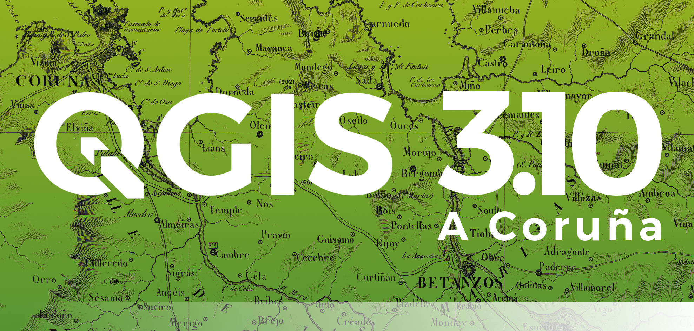
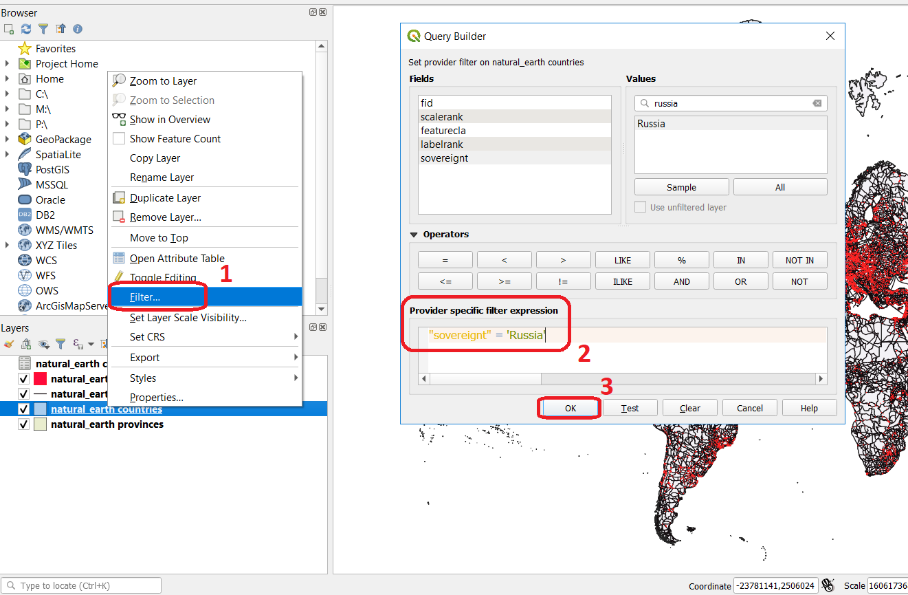

Document Layout
===============

This section provide examples on how to organize and format the content of exercises.

Exercise Title
--------------
Lorem Ipsum is simply dummy text of the printing and typesetting industry. Lorem Ipsum has been the industry's standard dummy text ever since the 1500s, when an unknown printer took a galley of type and scrambled it to make a type specimen book.

Exercise subsection
^^^^^^^^^^^^^^^^^^^
Lorem Ipsum is simply dummy text of the printing and typesetting industry. Lorem Ipsum has been the industry's standard dummy text ever since the 1500s, when an unknown printer took a galley of type and scrambled it to make a type specimen book.

Another Exercise subsection
^^^^^^^^^^^^^^^^^^^^^^^^^^^
Lorem Ipsum is simply dummy text of the printing and typesetting industry. Lorem Ipsum has been the industry's standard dummy text ever since the 1500s, when an unknown printer took a galley of type and scrambled it to make a type specimen book.

Another Exercise Title
----------------------

An Exercise subsection
^^^^^^^^^^^^^^^^^^^^^^
Lorem Ipsum is simply dummy text of the printing and typesetting industry. Lorem Ipsum has been the industry's standard dummy text ever since the 1500s, when an unknown printer took a galley of type and scrambled it to make a type specimen book.

Images and Figures
------------------

This is an image with no caption.

This is a figure: an image plus a caption. Use always with images describing processing steps or activities and add a meaningful caption.
Use this to refer to :numref:`figquerysimple`.
   
.. _mylabel:

   This the caption for this figure without a period

Tables
------

Lorem Ipsum is simply dummy text of the printing and typesetting industry. 

+------------+--------------+-----------+
| Header 1   | Header 2     | Header 3  |
+============+==============+===========+
| body row 1 | column 2     | column 3  |
+------------+--------------+-----------+
| \          | <-empty cell | column 3  |
+------------+--------------+-----------+

Hyperlinks
----------

This is a hyperlink to `QGIS Home Page. <https://qgis.org/en/site/>`_

This is a hyperlink with a  download icon :download:`exercise.zip <https://drive.google.com/file/d/1lbvEWTukZrLD5Omz_sJ4Ebgzjhtw2oqO/view?usp=sharing>`

Especial Content
----------------

+ Reference to the `Living Textbook2 <https://ltb.itc.utwente.nl/>`_ as inline text.

.. note:: 
   **QGIS.**
   Specific functionality or info about QGIS.

.. note:: 
   **Reflection.**
   Important concept or question, take some time to think about it.  

.. important:: 
   **Resources.**
   Description to the dataset (optional). A link to the exercise dataset: `exercise.zip <https://drive.google.com/file/d/1lbvEWTukZrLD5Omz_sJ4Ebgzjhtw2oqO/view?usp=sharing>`_  Followed by a list of datasets required for the exercise. 

.. attention:: 
   **Question.**
   Ask students to answer questions. Question will become pointers to the virtual discussion session.

Embedded Content
---------------

Video
^^^^^

*A short sentence introducing the video below and including a* `hyperlink. <https://player.vimeo.com/external/316725601.hd.mp4?s=c6af68bb5180619816eb0b847933d22d0f2972f2&profile_id=175filename=Basic_Digitizing.mp4>`_

   .. raw:: html

      <video width="560" height="315" controls>
         <source src="https://player.vimeo.com/external/316725601.hd.mp4?s=c6af68bb5180619816eb0b847933d22d0f2972f2&profile_id=175filename=Basic_Digitizing.mp4">
      </video>
