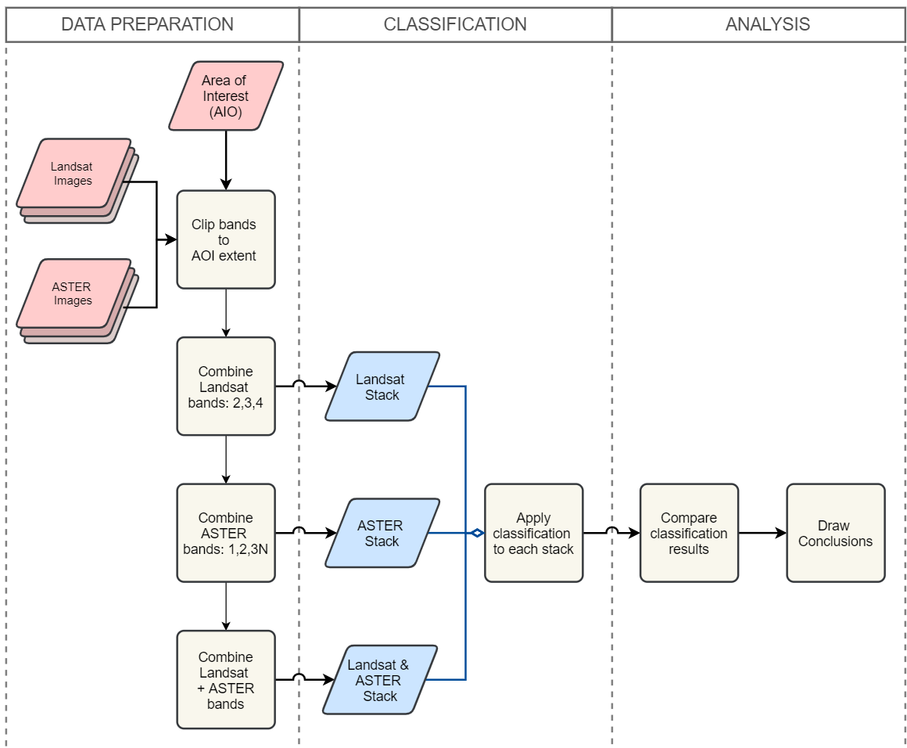
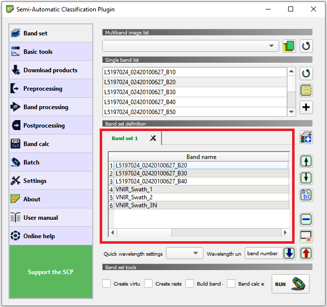
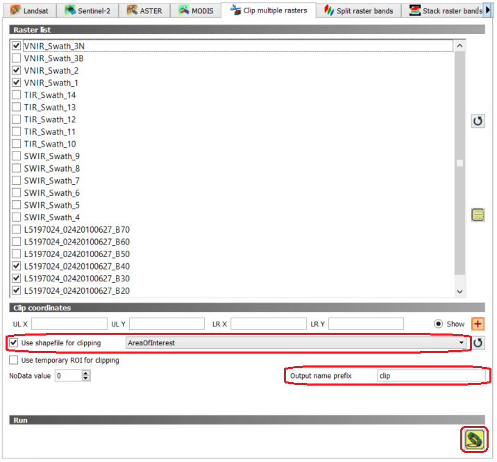
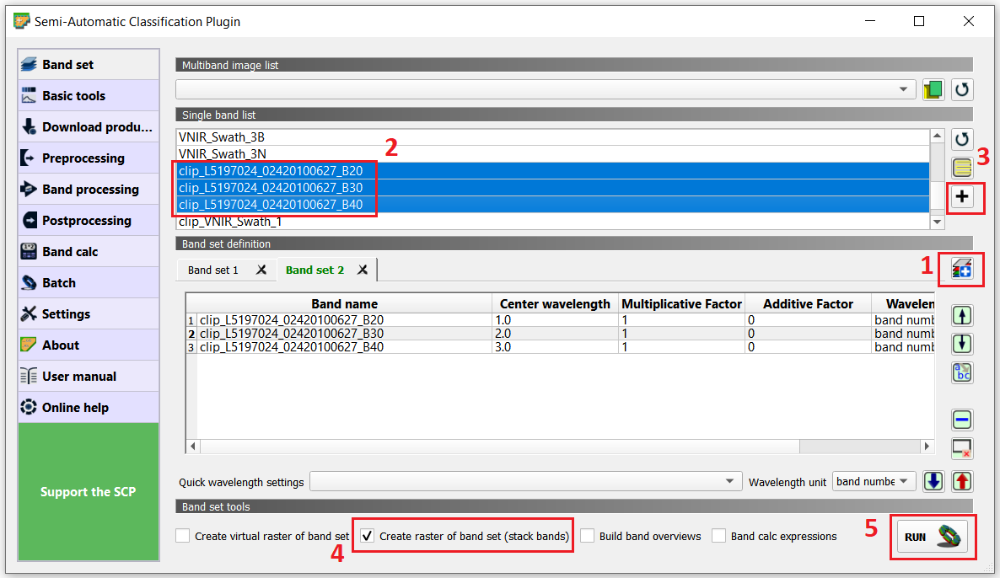
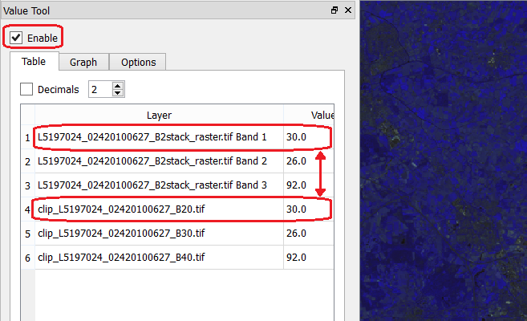
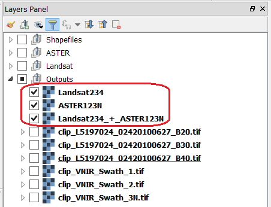

Bi-Temporal Classification
===============================

[DO WE SAY SOME WORDS ABOUT BI-TEMPORAL CLASSIFICATION, OR AT LEAS ABOUT THE OBJECTIVE OF THE EXERCISE?]

.. important:: 
   **Resources.**
   You will require the latest LTR version of `QGIS (A Coruna 3.10) <https://qgis.org/en/site/forusers/download.html>`_, plus the dataset `mono_bi_temporal_classification.zip <data-mono-multi_>`_ which you can download from CANVAS.  When you unzip the dataset, you will find the following directories and files: 
  
   + **Landsat** -  Images from the Lansat-TM, from 2010-06-23:

      + ``L5197024_02420100627_B10.tif``
      + ``L5197024_02420100627_B20.tif``
      + ``L5197024_02420100627_B30.tif``
      + ``L5197024_02420100627_B40.tif``
      + ``L5197024_02420100627_B50.tif``
      + ``L5197024_02420100627_B60.tif``
      + ``L5197024_02420100627_B70.tif``

   + **ASTER** - Images from the ASTER, from 2010-04--23:

      + ``VNIR_Swath_1.tif``
      + ``VNIR_Swath_2.tif``
      + ``VNIR_Swath_3B.tif``
      + ``VNIR_Swath_3N.tif``
      + ``SWIR_Swath_4.tif``
      + ``SWIR_Swath_5.tif``
      + ``SWIR_Swath_6.tif``
      + ``SWIR_Swath_7.tif``
      + ``SWIR_Swath_8.tif``
      + ``SWIR_Swath_9.tif``
      + ``TIR_Swath_10.tif``
      + ``TIR_Swath_11.tif``
      + ``TIR_Swath_12.tif``
      + ``TIR_Swath_13.tif``
      + ``TIR_Swath_14.tif``

   + **Shapefiles:**

      + ``Evaluation.shp`` - [NEED DESCRIPTION?]
      + ``AreaOfInterest.shp`` [NEED DESCRIPTION?]
   
   + **Output:** - An empty directory to store your results.

   + ``mono_bi-temporal_classification.qgs`` - a QGIS project loaded with the data above.

-----------------------------------

Setting Up the Analysis Environment
-------------------------------------

Before starting with the processing and analysis of the data in this exercise. We need to add specific tools for remote sensing to QGIS.

Task 1.1 
   Make sure that the **Semi-automatic Classification** (SCP) and **Value tool** plugins are installed.

Task 1.2 
   Configure QGIS to render layers using multiple CPU cores. Go to 
   :guilabel:`Settings` > :guilabel:`Options` > :guilabel:`Rendering` and make sure the option *Render Layers in parallel using many CPU cores* in on. Set :guilabel:`Max Cores` to the number of CPU cores in your computer, use at least 4 for better performance. See below.

   .. image:: _static/img/qgis-rendering-options.png 
      :align: center

In the following sections, we will conduct a data analysis to compare the differences between mono-temporal and bi-temporal digital image classifications. The workflow in :numref:`fig-bi-class-workflow` shows the steps (operations) for such data analysis.

.. _fig-bi-class-workflow:

   A flowchart for the comparison of 'mono' and 'bi' temporal image classification

---------------------------

Band Subsetting
----------------

We will start by stacking bands in three different combinations. One stack will combine three bands from Landsat-TM from  the 23-Apr-2010. Anothe stack  will combine three bands from ASTER, taken on the 23-Jun-2010. Finally, the last stack will combine all 6 bands in the previous two stacks. Three Landsat bands and three ASTER bands. 

Task
   Start by learning about the characteristics of the Landsat TM and  the ASTER sensors. Put special attention to the wavelengths of the different bands. Note that *the SWIR bands are not available in the ASTER images since 2008 due to the deterioration of the cooler system of the sensor.*

   Use the **ITC Sensor Repository** for this task:

   + https://www.itc.nl/Pub/sensordb/getsen.aspx?name=ASTER 
   + https://www.itc.nl/Pub/sensordb/getsen.aspx?name=TM 

.. attention:: 
   **Question.**
   Which three bands of Landsat TM and ASTER are very similar? 

Now that you known which bands are are identical. We will create a subset for the area in the  ``AreaOfInteres.shp``. That is, we will clip each band to the extent of the polygon in such file.

Task  2.1 
   Open the QGIS project ``mono_bi-temporal_classification.qgs``. Go to :guilabel:`SCP` >  :guilabel:`Band set`. Many of the operation available in **SCP** required to define a *band set* in advance. Then, the operation will be applied to all the bands in a set. **SCP** uses number to differenciate between band set. The current project already contains a band set **(1)** listing the all the bands we will need in this exercise. See :numref:`fig-scp-band-set2` 

.. _fig-scp-band-set2:

   Band set 1 in the 'mono_bi_temporal_classification' project

\

   Go to :guilabel:`Preprocessing` > :guilabel:`Clip multiple rasters`. For :guilabel:`Select input band set` select **1**.   Then, make sure the :guilabel:`Output name prefix` is set to ``clip``.
   Tick :guilabel:`Use shapefile for clipping` and select the *'AreaOfInterest'* layer. See :numref:`fig-scp-clip-multiple-raster` 
   Finally, click on |runSCP|. 
   
   The tool will ask you to provide directory to stored the output files. For convenience, use the empty  *Output* folder inside root directory for this exercise.

.. _fig-scp-clip-multiple-raster:

   The 'Clip multiple rasters' tool in the SCP plugin

   
.. note:: 
   **Reflection.**
   Keep your QGIS project organized. The *'mono_bi-temporal_classification'* project has a *layer group* named **“Outputs”**. Place the outputs of this exercise under in this group.  Alternatively, you can create your own groups to keep the project even more organised.  
   
   .. image:: _static/img/keep-project-organized.png
      :align: center

   \

   Moreover, *avoid having all the layers turned on.* Especially the original Landsat and ASTER layers; they will consume resources every time you zoom or pan over the map view.

----------------------

Band Stacking
-------------

As a next step, you will build three band stacks usign the subsets created above:

+ A first stack with Landsat bands :math:`2, 3` and :math:`4`
+ A second stack with ASTER bands :math:`1, 2` and :math:`3N`
+ A multi spectral and multi temporal stack with Landsat bands :math:`2, 3, 4`  and ASTER bands :math:`1, 2, 3N`

Task
   Create a new band stack for Lansat. Go to :guilabel:`SCP` > :guilabel:`Band set`. Then :guilabel:`Add a new band set` > :guilabel:`Select` bands :math:`2,3,4` from Landsat (**clip version**) > :guilabel:`Add band to Band set` > **check that bands are in the correct oder** > tick :guilabel:`Create raster or band set` > :guilabel:`Run`. See :numref:`fig-scp-band-stack`. Save the stack to the **Output** directory.

.. _fig-scp-band-stack:

   Creating a new `band stack`  in the SCP plugin

\
   
.. note:: 
   **QGIS.**
   The QGIS does not preserve the original numering of the bands in the new stack. This means you have to keep track of which bands in the *new stack*  correspond to the *original* dataset. 
   
   For the stack you just created, that means:

   ==============================     =========================
   Original band number (Landsat)	  Band number (New Stack)
   ==============================     =========================
   2                                   1 
   3                                   2 
   4                                   3 
   ==============================     =========================

\

You can verify the the *new stack*  combined the correct bands and in the correct order, using  the **Value tool** plugin.

Task 2.6 
   Open the **Value Tool** panel.  Go to :guilabel:`View` > :guilabel:`Panels` > tick the :guilabel:`Value Tool`. Enable the panel; make sure only active layers are the three Landsat subsets and the *new stack*.  Hover your mouse over the image and check tha the pixel values correspond between the subsets and the new stack. See :numref:`fig-stack-values` 
   
.. _fig-stack-values:

   Comparing pixe values between the 'Lansat subsets' and the 'Landsat 2,3,4 stack'

Task 2.7 
   Repeat the procedure in the previous Task, and create two more stacks. One for ASTER bands :math:`1, 2,  3N`. And one for the *'multi spectral and multi temporal'*, bands Landsat :math:`2, 3, 4`  and ASTER :math:`1, 2,  3N`  *Remember to keep track of order of the bands in the stacks.* We suggest the following arrangement:

+-----------------------------+-----------------------------+
| For ASTER band stack                                      |
+-----------------------------+-----------------------------+
|Original band number (ASTER) |  Band number (ASTER stack)  |
+=============================+=============================+
| 1                           |        1                    |
+-----------------------------+-----------------------------+
| 2                           |        2                    |
+-----------------------------+-----------------------------+
| 3N                          |        3                    |
+-----------------------------+-----------------------------+

+-----------------------------+-----------------------------+
| For ASTER band stack                                      |
+-----------------------------+-----------------------------+
|Original band number (ASTER) |  Band number (ASTER stack)  |
+=============================+=============================+
| Landsat 2                   |        1                    |
+-----------------------------+-----------------------------+
| Landsat 3                   |        2                    |
+-----------------------------+-----------------------------+
| Landsat 4                   |        3                    |
+-----------------------------+-----------------------------+
| ASTER 1                     |        4                    |
+-----------------------------+-----------------------------+
| ASTER 2                     |        5                    |
+-----------------------------+-----------------------------+
| ASTER 3N                    |        6                    |
+-----------------------------+-----------------------------+

Now, you should have  three band stacks in your project. We recommend you rename them in the **Layer panel**, so that  you can easily distinguish them. See below.

---------------------------

Classification
----------------

