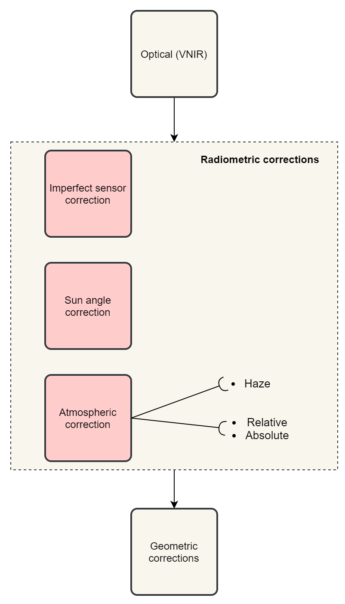

Radiometric Corrections
=======================

.. TODO: Looks ok to me even though you could use some filter kernels for imperfect sensor calibration and noise suppression (which is in your classification ‘correction’).

The procedures describe in this section fall within the “pre-processing” group of image processing techniques, and they focus on radiometric corrections. 

As shown in :numref:`fig-corrections-wkf`, correction techniques fall within three groups: |ltb| `Imperfect sensor correction <Correction of imperfections of a sensor_>`_, |ltb| `Sun angle correction`_ and |ltb| `Atmospheric correction`_. A common technique for atmospheric correction is |ltb| `Haze correction`_.

.. _fig-corrections-wkf:

   A sequence of possible corrections on optical imagery

.. important::
   **Resources.**
   You will require the latest LTR version of `QGIS (A Coruna 3.10) <https://qgis.org/en/site/forusers/download.html>`_, plus the dataset `Data_Atmospheric_Corrections.zip <data_atmospheric_corr_>`_ which you can download from CANVAS.  When you unzip the dataset, you will find the following files inside: 
   
   + ``etm99.img`` – Scene from Landsat Enhanced Thematic Mapper, bands 1 to 4. Wadden islands, 1999.
   + ``pan.img``  – Scene from SPOT, panchromatic band.
   + ``tm89.img`` – Scene from  Landsat Thematic Mapper.

   These three images are provided with almost cloud-free skies. 

Haze correction
---------------

Task 1 
   Use the `Satellite and sensor database <https://webapps.itc.utwente.nl/sensor/default.aspx?view=searchsat>`_ and the file and metadata information to find the information for the spectral specifications of *SPOT PAN, Landsat TM B1 to B4* and *Landsat ETM B1 to B4*. Then, complete the table below.

=====================       ============    ====    ===========================     ==============
Satellite/sensor            Filename(s)     Date    Approx. time of acquisition     Resolution GSD
=====================       ============    ====    ===========================     ==============
SPOT/HRG panchromatic       PAN        
Landsat-5/TM                TM89       
Landsat-7/ETM+              ETM99         
=====================       ============    ====    ===========================     ==============

.. attention:: 
   **Question.**
   Are the spectral characteristics of the TM and ETM sensors different? 

Task 2 
   Open  ``etm99.img``, ``pan.img``, and ``tm89.img`` in QGIS. and take a look at the images. Display all images using **bands 4, 3, 2 for RGB** and *No Stretch*. Open the **Value tool** to get pixel information. 
    
   Haze has an additive effect to the overall image, resulting in higher DN values. As a result, it is reducing the contrast of the image. Because this effect is :math:`\lambda`  dependent, its influence differs per band. 
    
   We will assume that there is a real *blackbody* present in the images; therefore, we can simply subtract to a minimum of zero. Assume that the blackbody, in this case, is *deep, clear and unpolluted water*. Complete the table below with the **minimum values** that you can find in such water body. Some hints are given below.

=====   =============   =========   =========   =========   =========
Image   Band 1 DN       Band 2 DN   Band 3 DN   Band 4 DN   Pan DN
=====   =============   =========   =========   =========   =========
PAN     **n.a.** [#]_   **n.a.**    **n.a.**    **n.a.**
TM89    **n.a.**        **n.a.**    **n.a.**                **n.a.**
ETM99                                                       **n.a.**            
=====   =============   =========   =========   =========   =========

.. [#] Not applicable

\

   Use the **Value tool** to read DN values. Note that the tool shows pixel values for all bands of the multispectral image. *Read the value for the proper band!*

   The island is surrounded by a tidal flat, which causes tidal currents with a tidal frequency. It is quite difficult to locate clear water in such situations. We recommend using a body with following water, rather small lake on the island as assumed-blackbody.

   1. Select the *'ETM99'* image, go to Properties and change the symbology to single band grayscale for Band 4. Set minimum to 0 and maximum to around 40 to increase the contrast for the lowest DN values (these are objects with the lowest reflectance properties, which are more likely to be water).

   2. Zoom into the area around :math:`[lat, long] = [53.46145,5.652432 ] or [x, y] = [676191, 5927074]` for comparison. This location is a small lake on the island and shows much lower values than most of the sea in the images. Search in the lake for the lowest DN value. Keep a list of lowest values on scratch paper and copy these to the table.

.. attention:: 
   **Question.** Compare the minimal value found in the lake or tidal flat with the minimum value in that band. 
   
   + Why is there a discrepancy between the values? Think about the spectral and spatial characteristics of the band and the spatial dimensions and spectral property of the object.

   + Why are there decreasing values for haze for *'ETM99'* from Band 1 to Band 4?
 
   + How can you explain the difference between the Haze values of the different images?

   +  What about the *'PAN'* image? What range on the spectrum does it cover? Does this relate to the observed difference between *'ETM99'* channels and the panchromatic channel? 

Task 3
   Correct the images for haze by subtraction values using the Raster calculator. In QGIS go to **Raster > Raster Calculator**. Specify the formula to subtract the Haze value from Band 4 and specify the name of the output file. 

   Select the newly created *Band 4 with haze correction* on the **Layers Panel**.  Go to  Properties of the layer and modify the contrast stretch as follows, minimum: 0,  maximum: 255. Do the same for the *Band 4  without haze correction.*

.. attention:: 
   **Question.**
   Compare the two versions of band 4  of *‘ETM99’*. Do they look different?

Verify that the histograms of the haze-corrected bands have shifted towards the origin. Both histograms have the same shape before and after haze correction but a different location. It also shows that there are apparently some pixels with DN values lower than the small lake on the island. These negative values should not exist in EO images but are caused by the fact that we use a GIS to do the calculation. Before continuing, we have to correct this artefact.

Task 4
   From the **Processing Toolbox**, use the SAGA module **Reclassify values (simple)** to set all negative values to 0. Select condition  ``[0] Low value <= grid value < high value``. Edit the Lookup table; delete two rows and enter :math:`-255` for *Low Value*. This will replace all values in the range  :math:`[-255,0]` with 0.

Task 5
   Calculate the Haze correction for all bands of *‘ETM99’*, for band 4 of *'TM89*' and *'Spot PAN'*, including the reclassification.

.. attention:: 
   **Question.**
   Suppose you had a SPOT image with the values for the channels that correspond to R, G, and B. Would the Haze values be different than those in the TM scene? Why or why not?

Sun Angle Correction
--------------------

So far we have corrected for haze by simplifying the illumination formula, such as:

.. math::

   DN = (T\sigma +  T\delta_i)R_i 

The sun angle determines the amount of irradiance per unit area on the ground. We can correct for sun angle attenuation by normalising the sun angle to a zenith situation.  We do this by dividing the image values by the sine of its sun elevation angle (in degrees). This correction will result in slightly higher values: 

.. math::
   DN' = \frac{DN}{sin(\sigma)}

Where :math:`DN` is the input pixel, :math:`DN’` is the output pixel value, and :math:`\sigma` is the sun angle. Note that because the angle is smaller than :math:`90˚` the sine will be smaller than 1 and as a result :math:`DN’ > DN`.

In case you have many images with various sun angles, you can calibrate them to the zenith.  Or you can select one of the images, which serves as a reference for sun angle correction, and correct to others to match the reference sun angle.

Absolute Sun Angle Correction
*****************************

Usually, you will find the sun elevation angle :math:` \sigma` in the header file of the images. However, this time, we provide the angle below for the *'SPOT PAN'* image.

.. attention:: 
   **Question.**
   What is the sine for the :math:`\sigma`  of the *’SPOT PAN’* image you used  in the previous section
   Write the answer in the table below.

   ======   ======================     ===================
   Scene    :math:`\sigma`             :math:`sin(\sigma)` 
   ======   ======================     ===================
   PAN      :math:`58.9^{\circ}`
   ======   ======================     ===================

Task 6
   Use the **Raster Calculator** to calculate to correct for the sun angle on the *’haze-corrected SPOT PAN’* image. 

Task 7
   Locate some particularly dark and bright pixels with the **Value tool** in the *’SPOT PAN’*, and examine the difference between *haze-corrected* and *haze-and-sun-angle-corrected* values.

.. attention:: 
   **Question.**

   + In which way have the values of the *haze-corrected* and *haze-and-sun-angle-corrected* images changed? Are the changes constant, linear, or exponential? Were the changes predictable?
   + Why did we apply haze correction before sun angle correction? Does the other of these corrections make a difference?
   + In case of multiband images, we do not need to calculate the sun-angle separately for each of the bands. Why not?

.. sectionauthor:: Wan Bakx