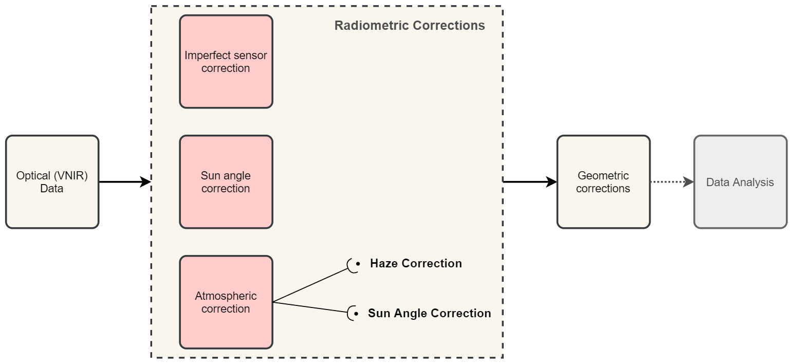

Radiometric Operations
======================

Image Enhancement by Histogram Operations
-----------------------------------------

.. important::
   **Resources.**

   You will require the latest LTR version of `QGIS (A Coruna 3.10) <https://qgis.org/en/site/forusers/download.html>`_, plus the dataset `data.zip <#>`_ which you can download from CANVAS.  When you unzip the dataset, you will find the following files inside: 
   
   + ``SPOT270611.img`` – SPOT 5 image with 4 spectral bands.
   + ``tm24aug99.img`` -  TM image of the 24th of august 1999.
   + ``tm24aug99_sub.tif`` -  a subset of tm24aug99.img
   + ``topo34f.img`` – scan of a topographic map in RGB.

Preparation
^^^^^^^^^^^

Through well-known plugins and/or providers, QGIS offers the possibility to apply all kind image enhancements for visualization purposes. In this exercise we will make use of such tools. Note that none of these tools changes the actual values stored in the raster datasets. They simply change the way the image is being displayed in order to highlight features that are not so obvious when using the default rendering settings.
 

Task 1.2 
   Disable the default contrast stretch. Go to *Settings > Options > Rendering* tab and scroll down to Contrast enhancement. Set the algorithms   *Single band gray, Multi band color (byte / band) and Multi band color (> byte / band)* to **No Stretch**. Set the *Cumulative pixel count cut*  to :math:`2.0` and :math:`98.0%`. Click OK to confirm. See Figure :ref:`fig-set-render` 

.. _fig-set-render:

   Chaging the default settings of contrast enhancement to 'No Stretch'

Single Band Display and Relative Brightness
^^^^^^^^^^^^^^^^^^^^^^^^^^^^^^^^^^^^^^^^^^^

Task 2.1 
   Create a new QGIS project and open  the ``topo34f.img``. 
   If required, change the colour composite for this layer such that Hydrographic elements like water bodies display in cyan colours (use the legend in the right down corner as reference). Do right-click on the layer, select Properties. In the Symbology panel change the band selection for Red, Green and Blue to *Layer_1,  Layer_2, and Layer_3.*

Task 2.2 
   Add  the  ``Spot270611.img`` to the project.   Change the display from the default *Multiband colour* to *Singleband Gray* and select ‘Band 1’ as the *gray band*. Right-click the *Layer name > Properties > Symbology tab > Render type > Singleband gray*.  Click Apply. The band will be displayed in a grey scale with poor contrast. Figure :ref:`fig-greyscale`

   .. _fig-greyscale:
   .. figure:: _static/img/task-greyscale-b1.png
      :alt: greyscale
      :figclass: align-center

      Displaying band 1 of ‘Spot270611.img’ as greyscale

   Then, set min and max values for the contrast stretch. Set **contrast enhancement** to *Stecht to MinMax*. Select *Cumulative pixel count cut* and set the  limits to 35% and 98%. Set **Accuracy** to  *Actual (slow)*. Figure :ref:`fig-minmax` . Click apply. This will copy the DN values associated with 35 and 98 cumulative percentage to respectively the Min and Max of the contrast.

   .. _fig-minmax:
   .. figure:: _static/img/contrast-minmax.png
      :alt: contrast minmax
      :figclass: align-center

      Contrast enhancement with ‘Stretch to MinMax’

   We chose a :math:`35%` for the minimum because the rectangular raster file does not contain image data values for the whole scene. Approximately :math:`35%` of the image contains pixels with a DN Value of 0 which in this case means **No Data**. After applying the settings above, the image will look like this.

   .. image:: _static/img/contrast-minmax-result.png 
      :align: center

   Repeat the previous task, and apply a *MinMax Stretch* to all bands of  ``Spot270611.img``. You can copy a layer by doing right-click on the *’Spot270611.img’* and then choose *Duplicate*.  Rename each layer such that it includes the band number. 

   .. image:: _static/img/task-copy-layer.png 
      :align: center

Task 2.5 
   Compare the result of each band by toggling the visibility of the layers off and on.  Give special attention to the comparison of band 3 and band 2. This two bands are displayed with similar composition, and jet they look quite different from the others. This a  proof that different spectral properties are measured in such spectral bands.

 Task 2.6 
   Use the topographic map ``topo34f.img`` to find areas with Water (Cyan), Buildings (Purple) and Evergreen Forest (Green with overprinted symbols). Then, identify the brightness in each of the four bands associated to the types of areas listed above. Complete the table below.

   .. image:: _static/img/task-cover-table.png 
      :align: center

   Do not spend too much time in identifying representative objects and filling the table above. Remember that the decision whether something is grey or light grey is subjective; thus use the same subjectivity when you fill in the table. If you think a class is represented with more than one brightness, you may select more boxes.

.. note:: 
   **Reflection.**
   While completing the previous task, you should have noticed that different classes of land cover may have similar or different brightness within an specific spectral band. Moreover, the same class of land cover may have different brightness in different bands. 

Multiband Display: Understanding Colour Composites
^^^^^^^^^^^^^^^^^^^^^^^^^^^^^^^^^^^^^^^^^^^^^^^^^^

This section will help you to understand the relationship between the spectral property of a class, the selection of  spectral bands for visualisation, and the choice of spectral bands in a colour composite. 
Suppose you have a **SPOT XS** image which includes land cover the types: soil, vegetation and water. Such an image will be displayed with a *contrast stretch* with the band combination of 3, 4 and 2 for RGB. 

.. attention:: 
   **Question.**
   Which colours will the land cover types above will have in the colour composite mentioned above? You were introduced in the lecture on how this works for one  and two spectral bands. Now it is your turn to predict the case for a 3-bands colour composite.

   Use the  reflectance curves below to estimate how much each of the three land cover types will reflect relative to each other, for each of the *’SPOT XS’* bands.
   
   For this end, assume that there are no other land cover types in the image; thus the land cover with the highest reflectance will have the highest Digital Number in a band, and  it will be displayed with the highest brightness (i.e.  :math:`DN=255`). Likewise, the land cover with the lowest reflectance in a band will be displayed with the lowest brightness (i.e.  :math:`DN=0`). For the land cover types with in between reflectance values, use linear interpolation to estimate its brightness value.

   .. image:: _static/img/spectral-curves-bands.png 
      :align: center

Task
   Copy RGB brightness values that you estimated into the table.  Then use  an  `RGB calculator  <https://www.w3schools.com/colors/colors_rgb.asp>`_ to determine the approximated colour of each land cover type in this colour composite.

   ================  ===============   =================    ================     ===================
   Major land cover  Band 3 (Red)      Band 4 (Green)       Band 2 (Blue)        Colour in composite
   ================  ===============   =================    ================     ===================
   Dry bare soil
   Vegetation
   Water
   ================  ===============   =================    ================     ===================

.. note:: 
   **Reflection.**
   On the basis of just theoretical knowledge, you can predict the colour of a land cover type in a colour composite (assuming  there are no other land cover types present in an image, which may have a lower or higher reflectance). Take the time to  understand this statement and study the topic once more if necessary. You could also discuss this topic further in the virtual classroom.

Multiband Display: Applying Colour Composites
^^^^^^^^^^^^^^^^^^^^^^^^^^^^^^^^^^^^^^^^^^^^^

In the previous section, you determine the relative brightness for three  types of land cover. Then you determined the theoretical colour in a specific colour composite. In this section, we will compare the theoretical colour for water and vegetation with the actual colour in the colour composite.

Task 4.1 
   Open the ``Spot270611.img`` in QGIS and use a band combination  of 3, 4 and 2 for Red, Green and Blue. Set the contrast enhancement to :math:`35%` and :math:`98%` for all bands using the Actual (slower) Accuracy, as shown below.

   .. image:: _static/img/task-spot-composite.png
      :align: center

   Zoom into image so that you can easily confirm what colour was assigned to water. Also verify whether the theoretical colours, you determined in the previous section, math colours that you see in this colour composite.

.. attention:: 
   **Question.**
   When comparing the theoretical colours and the result of applying the colour composite,  you will find out that there is some discrepancies.What could be the courses behind such discrepancies?

By now you should have learned that knowing the relative spectral reflectance of classes indicating the relative brightness’s in various spectral bands help you to understand and interpret images. And that you can predict the ranges of DN values for an specific object, when you know and understand the spectral properties of such objects.

Some land cover types might have similar or the same spectral reflectance property in certain ranges of the Electromagnetic (EM) spectrum. The integration of more bands in  the analysis,  and the assessment of the spectral properties in other ranges of the EM spectrum, can result in the successful discrimination of more types of land cover. This is true not only in the case of land cover, but also for many other objects in an remote sensing image.

Image Enhancement by Histogram Operations
^^^^^^^^^^^^^^^^^^^^^^^^^^^^^^^^^^^^^^^^^

One method to enhance images, for interpretation or analysis, uses histogram operations. These operations are usually referred to as **global contrast enhancement operations**.
To experiment with contrast enhancement, we will use a TM image of the 24th of august 1999, ``tm24aug99.img``. This image covers a large water body and different types of  land cover,  and it has areas are covered by clouds. 

Contrast Stretching
*******************

 Task 5.2 
   Display the  ``tm24aug99.img`` using the band combination 4, 5 and 3. Set the *Stretch to MinMax* to a *Mean +/- standard deviation* of  2.0, and the *Accuracy* to **Actual (slower)**; as shown below.

   .. image:: _static/img/task-sdeviation-stretch.png
      :align: center

Task 5.3 
   Zoom in to an area covered by clouds over the main land (centre right). Open the **Layer Properties** dialogue and select the **Symbology** panel. Then change the **Statistics extent** to *Current canvas* and apply.

   Select to **Zoom Full** to zoom out to see the whole image. Instead of  seeing clouds in whites and pinks,  you now can see clouds in several colours. 

   .. image:: _static/img/task-cloud1.png
      :align: center
   
   .. figure:: _static/img/task-cloud2.png
      :alt: contrast stretch to clouds
      :figclass: align-center

      Top: Image 'tm24aug99' with global contrast enhancement. Bottom: Image 'tm24aug99' with a local contrast enhancement for clouds

.. attention:: 
   **Question.**
   Do you also think that main land displaying in a not-so-good way?

Task 5.4 
   Zoom into an area with mostly land and some water,  and re-apply the same  *Contrast enhancement* method as before. You can use the context sensitive option **Stretch using current extent** as shown below, but verify that it does what you intended.

   .. image:: _static/img/task-apply-stretch.png
      :align: center

You will noticed a change in contrast in the image. This is because the part of the image that is  currently visible include different types of land cover; thus different statistics. The results of a contrast stretch based on statistics changes, when the range of values use to compute such statistics change.

Task 5.5 
   Set the **Contrast enhancement** back to *Mean +/- standard deviations* and the **Statistics extent** to  *Whole raster*. Then, right-click the *’ tm24aug99’* layer and select *Export > Save as...*. For  **Output mode** select *Rendered image* and enter a self-explanatory name for the output file. Save the file to an existing folder. The file will automatically be added to the Map View.

.. attention:: 
   **Question.** 
   Is the exported image different from the original ``tm24aug99.img``? 
   
   Compare the properties of the two files, especially the histogram. Determine whether they only look alike, but are not the same. You can use the **Value tool** for the comparison by setting it up in such a way that the tool shows the values of one band  for both images, as shown below.

   .. image:: _static/img/value-tool-byband.png
      :align: center

Choosing Min and Max values
***************************

To choose the *min* and *max* values for a contrast stretch, the user have to consider which areas of an image are of interest, or which types of land cover are relevant for certain purposes. To help this choice, we built a model which you can to extract the local statistics for an area of interest.  In this section you will experiment with such model.

Task 5.7	
   To use the model you first have to import it to QGIS. In the **Processing Toolbox**, click on the *Model icon* and select **Add Model to Toolbox**. Select the model ``Raster_Statistics_By_Extent.model3`` that is included with the dataset. Click Open. The model will be imported and shown in the *Models section*. 

   .. figure:: _static/img/task-add-model.png
      :alt: add model
      :figclass: align-center

      Adding a model to the Processing Toolbox

Task 5.6	
   Remove the exported image from the project, keep only the original image. Zoom into an area on the main land which is primarily dark orange/brown, they represent areas with forest.

   Then, use the *’Statistics of Raster by extent’* model to calculate the local statistics. Double click the model and provide an *Extent* and an *Input raster file*. Run the model. The model creates a rectangle from the input Extent, which contains an attribute table with the computed statistics for each band of the Input raster. 

   Copy the min and max values for each band to the **Band Rendering** dialogue on the *Symbology* window and apply the changes. This would enhance the contrast for the areas that contain forests.

.. note:: 
   **QGIS.**
   [CHECK WITH ANDRE]
   The  *’Statistics of Raster by extent’* model will always list the result using the name *Band 1, Band 2 and Band 3*. These numbers do not correspond to the number in *Input raster file*; instead they correspond to the order in which the bands are were displayed in RGB when running the model. For example, in this case Band 1 contains the statistics that correspond to the band assign to the Red channel, that is *Band 5* of the...

To properly apply contrast enhancement for specific types of land covers, you need to know which are the types  of interest; which their spectral signatures are; the specifications of the spectral bands of the sensor which you have chosen; and  you need knowledge of additive colour mixture.

Task 5.9	
   Add the ``tm25aug99_sub.img`` to the project, and display it using a band combination 4, 5 and 3. this image covers shallow water and land with various types of land cover. Analyse the histograms of the three bands of this image, *right-click on the layer > select Properties > Histogram tab*. Compute the histogram is necessary. Then, select *Prefs/Actions > Show selected band* and choose the band want to inspect.

.. attention:: 
   **Question.** 
   In which band on display do you expect a major difference in DN Values between water and land? Use your knowledge on EM radiation. A bi or tri-modal trend in histogram is an important clue.

Task 5.10
   Use the histograms to identify approximate values for a *contrast stretch* which will enhance the  contrasts between types of coverage on the part of the image with land. Save the result using the **Export As..**  and  *Rendered image* options. Remove the resulting layer from the project.
 
Task 5.12
   Repeat the previous task. This time use the histograms to set a contrast that will enhance the image specifically for distinguishing shallow water.

.. note:: 
   **Reflection.**
   By now, it should be clear to you that for some contrast enhancement methods,  statistics of the data play an important role, e.g. mean and standard deviation, minimum and maximum. However,  when you have knowledge about the spectral properties of the objects of interest, the  characteristic of the scene and the sensor, you can interpret the histograms directly and make improvements to make effective use of the brightness values in an image.

Correction of Atmospheric Disturbances 
--------------------------------------

The procedures describe in this section fall within the “pre-processing” group of image processing techniques, and they focus on radiometric corrections.

   A sequence of possible corrections on optical imagery

.. important::
   **Resources.**

   You will require the latest LTR version of `QGIS (A Coruna 3.10) <https://qgis.org/en/site/forusers/download.html>`_, plus the dataset `data.zip <#>`_ which you can download from CANVAS.  When you unzip the dataset, you will find the following files inside: 
   
   + ``etm99.img`` -  Landsat Enchanced Thematic Mapper
   + ``pan.img``  - SPOT panchromatic
   + ``tm89.img`` - Landsat Temathic Mapper

   These three images are provided with almost cloud-free skies. 

Haze correction
^^^^^^^^^^^^^^^

Task 2.1 
    Use the `Satellite and sensor database <#>`_ and the file and meta data information to find the information for the spectral specifications of *SPOT PAN, Landsat TM B1 to B4* and *Landsat ETM B1 to B4*. Then, complete the table bellow.

=====================       ============    ====    ===========================     ==============
Satellite/sensor            File name(s)    Date    Approx. time of acquisition     Resolution GSD
=====================       ============    ====    ===========================     ==============
SPOT/HRG panchromatic       PAN			
Landsat-5/TM                TM89			
Landsat-7/ETM+              ETM99			
=====================       ============    ====    ===========================     ==============

.. attention:: 
   **Question.**
   Are the spectral characteristics of the TM and ETM sensors different? 

Task 2.2 
    Open  ``etm99.img``, ``pan.img``, and ``tm89.img`` in QGIS. and take a look at the images. Display all images using **bands 4, 3, 2 for RGB** and *No Stretch*. Open the **Value tool** to get pixel information. 
    
    Haze has an additive effect to the overall image, resulting in higher DN values. As a result, it is reducing the contrast of the image. Because this effect is :math:`\lambda`  dependent, its influence differs per band. 
    
    We will assume that there is a real *blackbody* present in the images; therefore we can simply subtract to a minimum of zero. Assume that the blackbody in this case is *deep, clear and unpolluted water*. Complete the table below with the **minimum values** that you can find in such water body. Some hints are given below.

=====   =============   =========   =========   =========   =========
Image   Band 1 DN       Band 2 DN   Band 3 DN   Band 4 DN   Pan DN
=====   =============   =========   =========   =========   =========
PAN     **n.a.** [#]_   **n.a.**    **n.a.**    **n.a.**
TM89    **n.a.**        **n.a.**    **n.a.**                **n.a.**
ETM99                                                       **n.a.**            
=====   =============   =========   =========   =========   =========

.. [#] Not applicable

   Use the **Value tool** to read DN values. Note that the tool shows pixel values for all bands of the multispectral image. *Read the value for the proper band!*

   The island is surrounded by a tidal flat, which causes tidal currents with a tidal frequency. It is quite difficult to locate clear water in such situations. We recommend using a body with following water, rather small lake on the island as  assumed-blackbody.

   1. Select the *'ETM99'* image, go to Properties and change the symbology to single band grayscale for Band 4. Set minimum to 0 and maximum to around 40 to increase the contrast for the lowest DN values (these are objects with the lowest reflectance properties, which are more likely to be water).

   2. Zoom into the area around :math:`[lat, long] = [53.46145,5.652432 ] or [x, y] = [676191, 5927074]` for comparison. This location is a small lake on the island, and shows much lower values than most of the sea in the images. Search in the lake for the lowest DN value. Keep a list of lowest values on scratch paper and copy these to the table.

.. attention:: 
   **Question.** Compare the minimal value found in the lake or tidal flat with the minimal value in that band. 
   
   + Why is there a discrepancy between the values? Think about the spectral and spatial characteristics of the band and the spatial dimensions and spectral property of the object.

   + Why are there  decreasing values for Haze for *'ETM99'* from Band 1 to Band 4?
 
   + How can you explain the difference between the Haze values of the different images?

   +  What about the *'PAN'* image? What range on the spectrum does it cover? Does this relate to the observed difference between *'ETM99'* channels and the panchromatic channel? 

Task 
    Correct the images for haze by subtraction values using the Raster calculator. In QGIS go to **Raster > Raster Calculator**. Specify the formula to subtract the Haze value from Band 4 and specify the name of the output file. 

    Select the newly created *Band 4 with haze correction* on the **Layers Panel**.  Go to  Properties  of the layer and modify the contrast stretch as follows. Minimum 0,  maximum 255. Do the same for the *Band 4  without haze correction.*

.. attention:: 
   **Question.**
   Compare the two versions of band 4  of *‘ETM99’*. Do they look different?

Verify that the histograms of the haze-corrected bands have shifted towards the origin. Both histograms have the same shape before and after haze correction but a different location. It also shows that there are apparently some pixels with DN values lower than the small lake on the island. These negative values should not exist in EO images but are caused by the fact that we use a GIS to do the calculation. Before continuing we have to correct this artefact.

Task 2.8 
    From the **Processing Toolbox**, use the SAGA module **Reclassify values (simple)** to set all negative values to 0. Select condition  ``[0] Low value <= grid value < high value``. Edit the Lookup table; delete two rows and enter :math:`-255` for *Low Value*. This will replace all values in the range  :math:`[-255,0]` with 0.

 Task 2.9 
    Calculate the Haze correction for all bands of *‘ETM99’*, for band 4 of *'TM89*' and *'Spot PAN'*, including the reclassification.

.. attention:: 
   **Question.**
    Suppose you had a SPOT image with the  values for the channels that correspond to R, G, and B. Would the Haze values be different than those in the TM scene? Why or why not?

Sun Angle Correction
^^^^^^^^^^^^^^^^^^^^

So far we have corrected for Haze by simplifying the illumination formula, such as:

.. math::

   DN = (T\sigma +  T\delta_i)R_i 

The amount of irradiance per unit area on the ground is determined by the sun angle. We could correct for sun angle attenuation (normalise the sun angle to a zenith situation) by dividing the (single) image values by the sine of its sun elevation angle (in degrees). This will result in slightly higher values: 

.. math::
   DN' = \frac{DN}{sin(\sigma)}

Where :math:`DN` is the input pixel, :math:`DN’` is the output pixel value, and :math:`\sigma` is the sun angle. Note that because the angle is smaller than :math:`90˚` the sine will be smaller than 1 and as a result :math:`DN’ > DN`.

In case you have multiple images with varying sun angles you could calibrate them to zenith, or select one of the images as reference and correct to others to match the reference sun angle.

Absolute Sun Angle Correction
*****************************

Usually, you will find the sun elevation angle :math:` \sigma` in the header file of the images. However, this time, we provide the angle below for the *'SPOT PAN'* image.

.. attention:: 
   **Question.**
   What is the sine for the :math:`\sigma`  of the *’SPOT PAN’* image you used  in the previous section
   Write the answer in the table below.

   ======   ======================     ===================
   Scene    :math:`\sigma`             :math:`sin(\sigma)` 
   ======   ======================     ===================
   PAN      :math:`58.9^{\circ}`
   ======   ======================     ===================

Task 3.2 
   Use the **Raster Calculator** to calculate to correct for the sun angle on the *’haze-corrected SPOT PAN’* image. 

Task 3.3 
   Locate some particularly dark and bright pixels with the **Value tool** in the *’SPOT PAN’*, and examine the difference between *haze-corrected* and *haze-and-sun-angle-corrected* values.

.. attention:: 
   **Question.**

   + In which way have the values of the *haze-corrected* and *haze-and-sun-angle-corrected* images changed? Are the changes constant, linear, or exponential? Was the change predictable?
   + Why did we apply haze correction before sun angle correction? Does the other of these corrections make a difference?
   + In case of multiband images, we do not need to calculate the sun-angle separately for each of the bands. Why not?

