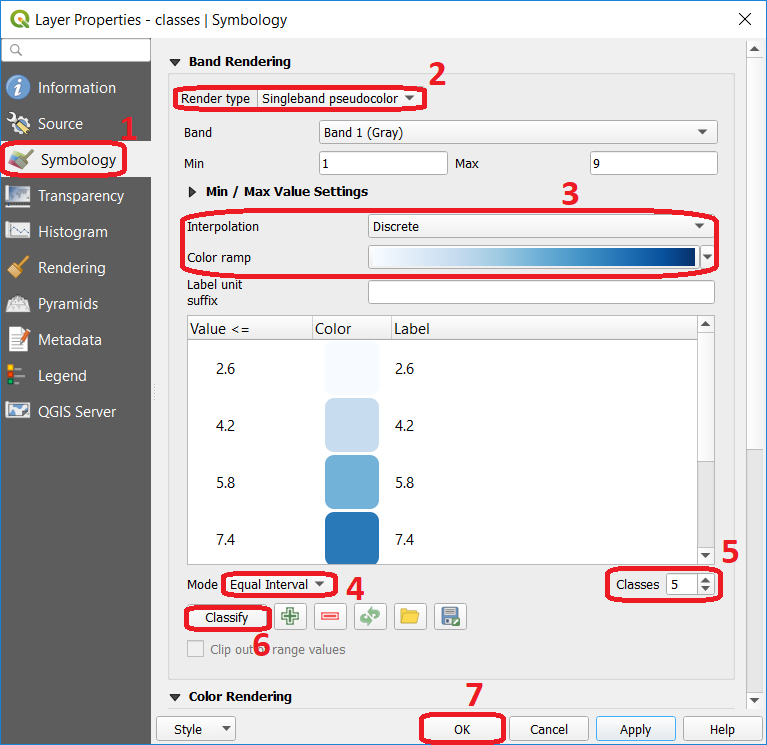

Raster Analysis
===============

.. important:: 
   **Resources.**
   You will require the latest LTR version of `QGIS (A Coruna 3.10) <https://qgis.org/en/site/forusers/download.html>`_, plus the dataset `raster-analysis.zip <raster_analysis>`_ which you can download from CANVAS.  For this section, you will need the following files: 

    + ``classification.qgs`` – a QGIS project preloaded with the datasets described below;

        + ``classes.tif``

Reclassification
----------------

Start this section by reading about the general aspect of `Reclassification`_.

.. attention:: 
   **Question.**
    
   + Explain in your own words, which are the differences and similarities between classification and re-classification? 
   + What is the difference between re-classification of vector data and re-classification of raster data?

When applying a reclassification to a raster layer, you often reduce the number of different cell values, and group them into class values. By means of reclassification, the level of detail in a raster input layer can be reduced and reveal general patterns in a dataset. 
There are different classification methods for raster datasets, two of those are `User controlled classification`_ and `Automatic reclassification`_. 

.. attention:: 
   **Question.**
   
   + In which type of classification is post-processing relevant?
   + How does post-processing relate to the concepts of aggregation, merging, and dissolving?

Automatic Classification
------------------------

Task 1.1 
    Below, you see a raster layer represented as an array of values. Classify  the values by applying the equal interval and the equal frequency techniques. Use five classes and write down the classified values in the boxes below. A good approach is to draw a raster attribute table first, which indicates the values and their frequencies, and then determine the new class values. 

    .. image:: _static/img/task-reclass.png
       :align: center

Task 1.2 
    The input layer mentioned in the previous task, it is also provided in the exercise’s dataset. Open the project *'Classification'*,  then from the **Layers** panel, right click over the layer classes, and apply a symbology using an equal interval classifier, :numref:`fig-auto-class` . Repeat the previous steps, and this time apply a quantile classifier. Compared the results.

    .. _fig-auto-class:
    .. figure:: _static/img/task-auto-class.png
       :alt: automatic classification
       :figclass: align-center

       Step to perform automatic classification via the symbology window.

----------------------------------

Manual Classification
---------------------

You can also manually control the number  of classes and the ranges of values belonging to each class. You can do this from the same menu as before, :numref:`fig-manual-class` ; or you can define reclassification rules that will create a new raster.

.. _fig-manual-class:

   Manual classification using the symbology window.

.. note:: 
   **QGIS.**
   When You classify a raster using the symbology menu, you are not changing the pixel values, you are simply grouping the pixels for visualisation purposes. If you want to generate a raster whose pixel values are actually overwritten according to whatever rules you decide, then you have to create a new raster using the steps in the next task.

Task 1.3 
    Say you want to create a new raster which grouped values (reclassify) according to what we shown in Figure 2. That is 3 classes ( :math:`class1 =1,  class2 = 2 \ to \ 6,` and :math:`class3 = 7 \ to \ 9`). In the **Processing toolbox**, open the tool **Classify by table** and write down the reclassification rules as shown in :numref:`fig-class-table`.

    .. _fig-class-table:
    .. figure:: _static/img/task-class-table.png
       :alt: reclassify by table
       :figclass: align-center

    Steps for creating a raster using Reclassify by table.

.. note:: 
   **QGIS.**
    We highly recommend that at this point you install the **Value Tool Plugin**. It allows you to see the pixel values of all the active raster at current location of the mouse pointer. :numref:`fig-result-reclass`

    .. _fig-result-reclass:
    .. figure:: _static/img/result-reclass.png
       :alt: result reclassify by table
       :figclass: align-center

       Result of applying a manual classification using Reclassify by table.

    Please refer to the QGIS training manual, section `Installing Plugins <https://docs.qgis.org/3.10/en/docs/training_manual/qgis_plugins/fetching_plugins.html>`_, or refer to the video `Installing Plugin in QGIS <https://vimeo.com/showcase/5716094/video/201997421>`_.

    .. raw:: html

        <video width="560" height="315" controls>
            <source src="https://vimeo.com/showcase/5716094/video/201997421">
        </video>

.. attention:: 
   **Question.**

    + If we have pixels whose values are not covered by any reclassification rule, what value will it be assigned to those pixels in the new raster?  
    + Will the new raster delete those pixels (i.e. null), assign a random value, preserve the original value, or something else?

    + To test your understanding on classification techniques; imagine you are going to make a map showing the “happiness” of the countries of the world, as of 2012, and you want to reclassify the data on happiness. Below you see a map and a scatter plot of the data. What reclassification technique would you apply and why?

   .. image:: _static/img/happiness-map.png
      :align: center
    
   \

   .. image:: _static/img/happiness-plot.png
      :align: center

.. Continue with part 2