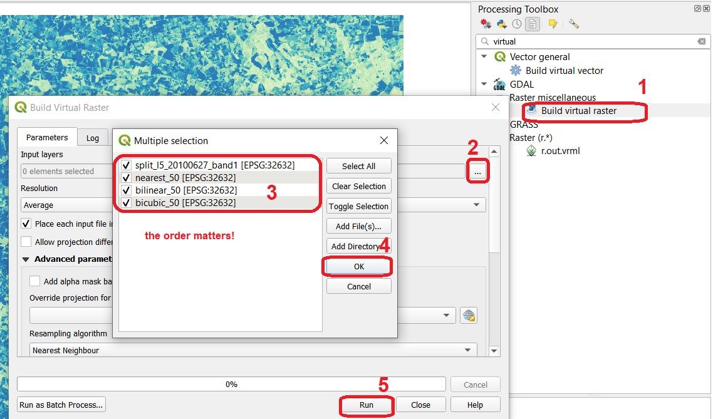

Resampling
==========

.. TODO:
   - make changes based on feedback
   - test links
   - add Task numers
   - check style
   - check style

In data integration, **resampling** of images is an important pre-processin step, specially  when we are dealing with datasets with different spatial resolutions and scales. When the  differences in the spatial resolution between the input and the output are *small*, simple interpolation methods are good enough for estimating pixel values. However, when the such differences are big,  then we need to apply  *aggregation*.

The image you will be working on is a subset taken from band 1 of Landsat 5 sensor and it has a pixel size of :math:`30 \ m`.

.. important:: 
   **Resources.**
   You will require the latest LTR version of `QGIS (A Coruna 3.10) <https://qgis.org/en/site/forusers/download.html>`_, plus the dataset `resampling.zip <data_resampling>`_ which you can download from CANVAS.  When you unzip the dataset, you will find the following files inside: 
  
   + ``l5_20100627_band1.tif`` -  an image subset from band 1 of Landsat 5 and spatial resolution of :math:`30 \ m`.
   + ``grid.shp`` - a vector dataset representing a grid for the origina pixel size of the Landsat 5 image. 
   + ``average.txt`` - a file with a  kernel filter definition.
   + ``Resampling.qgs`` - a qgis project file loaded with data layers and styles.

Task 1
   Make sure you have the **Map swipe tool** and **Value Tool** plugins installed.

Task 2 [KEEP IT!]
   Configure QGIS to render layers using multiple CPU cores. Go to 
   :guilabel:`Settings` > :guilabel:`Options` > :guilabel:`Rendering` and make sure the option *Render Layers in parallel using many CPU cores* in on. Set :guilabel:`Max Cores` to the number of CPU cores in your computer, use at least 4 for better performance. See below.

   .. image:: _static/img/qgis-rendering-options.png 
      :align: center

---------------------------

Simple resampling
------------------

Assume that we are going to use the Landsat image as input for a model. The model requires a grid size of :math:`50 \ m`, thus we have to resample the image to a pixe size of :math:`50 \ m` before proceeding with the modelling. 

.. note:: 
   **Reflection.**
   In this section, we make assumption that applying a resampling before the main data processing operations (modelling in this case) is the correct procedure. *Note that in many cases it may be more accurate to process the image first and then do the resampling.*

   Read the details about resampling on the |ltb| `Geocoding`_ page. 

Resampling techniques
^^^^^^^^^^^^^^^^^^^^^^

 Task 2.1 
   Start QGIS and open the *'Resampling'* project.
   From the :guilabel:`Processing toolbox`, open the tool **r.resamp.interp** and resample the image ``l5_20100627_band1.tif`` to :math:`50 \ m`. Use the **nearest** (neighbor) interpolation method. See :numref:`fig-resamp-interp-50`  Provide a self-descriptive name for the output file, for example: *nearest_50*

.. _fig-resamp-interp-50:

   The 'r.resamp.interp tool. Resampling to 50 m using the 'nearest' method

Task 2.3 
   Repeat the previous task. This time use the **bilinear** and **bicubic** interpolation methods. Make sure to provide meaningful names for the outpts. For example: *bilinear_50*, and *bicubic_50* respectively.

.. attention:: 
   **Question.**
   Resampling relies on interpolation techniques and therefore it relies on Tobler’s first law of geography:  *locations that are closer together are more likely to have similar values than locations that are farther apart.* Keeping this  law in mind and considering the image below, can you think of a use case where one of these resampling techniques should be chosen over the other two and why? 
   [ NEARES OR BILINEAR?] generic question, only in the context of the figure below.
   figure shows which pixels are considered in resampling.

   .. image:: _static/img/resampling-techniques.png 
      :align: center

Task 2.4 
   Copy the style of layer *'l5_20100627_band1'* and paste it on the *resampled* layers you created. To copy the style: :guilabel:`Right click`   on *'l5_20100627_band1'* > :guilabel:`Styles` > :guilabel:`Copy style`. See below. To paste the style: :guilabel:`Right click`   on the *layer where your want to paste the style* > :guilabel:`Styles` > :guilabel:`Paste style`. 

   .. image:: _static/img/copy-style.png 
      :align: center

Having the original and the resampled images with the same style, will make it easier to compare the result of the different resampling techniques.

Comparing the images
^^^^^^^^^^^^^^^^^^^^^^^^^

You should now have four raster layers in your project. The original *Landsat band 1*  and  three additional images resulting from the resampling. See :numref:`fig-layers-panel-resampling`

.. _fig-layers-panel-resampling:

   Layers resulting from the resampling of  'l5_20100627_band1' using different techniques

.. note:: 
   **Reflection.**
   When you resample an image  to a *lower resolution*, you are not producing data in the sense of previouly unknown information. You are simply creating coarser versions of the original data. This results in a loss of precision that might be acceptable or not depending on what the analysis is about.  [DOES THIS MAKE SENSE? HOW?]

   key idea. tools does not produce information, resampling implies loss of info. is the loss or not? Rephrase. 

Task 2.5 
   Perform a visual comparison on the size and values of the pixels of the four raster layers. :guilabel:`Zoom` into to *'grid'* layer and explore the raster layers usng the  **Value tool** and **Swipe map tool** plugins. Watch the video tutorial on `visually comparing rasters <https://player.vimeo.com/video/235504017>`_.
   

.. raw:: html

   
<iframe src="https://player.vimeo.com/video/235504017?color=007e83&portrait=0" style="position:absolute;top:0;left:0;width:100%;height:100%;" frameborder="0" allow="autoplay; fullscreen" allowfullscreen></iframe>

.. note:: 
   **Reflection.**
   Relate the differences you observe in *resampled layers* with the theory you learned in resampling and |ltb| `Geocoding`_.

Another way to compare the resampling results is to plot them in a histogram, and the look at the differences in the distribution of the values.  To do this, we need to stack the individual resampling results in a single layer stack.

Task  2.6 
   From the :guilabel:`Processing Toolbox`, open the  **Build Virtual Raster** tool. 
   For :guilabel:`Input layers` select: *'l5_20100627_band1'*, *'nearest_50'*, *'bilinear_50'* and *'bicubic_50'*. Name the resulting stack as  **stack_50**. See :numref:`fig-build-virtual-raster`

.. _fig-build-virtual-raster:

   Building a virtual raster stack with the resampled raster layers

Task 2.8 
   Compute the histogram for all bands of the *'stack_50'* stack. :guilabel:`Right click` over  *'stack_50'* layer > :guilabel:`Properties` > :guilabel:`Histogram` > :guilabel:`Compute histogram`. You should see a histogram like the one below:

   .. image:: _static/img/histogram-stack50.png 
      :align: center

.. attention:: 
   **Question.**
   How do you explain the differences in the distribution of values in the histogram? Especially for *band 2* (nearest_50) and *band 4* (bicubic_50).

------------------------------

Advanced resampling
--------------------------

For many practical applications, you have to resample an image to *much larger pixel sizes* than the original. In thi section, you will resample the image to a  pixel size of :math:`200 \ m`. For the sake of comparison, you will use a **optimal** and a **sub-optimal** method.

Optimal Resampling: with Aggregation
^^^^^^^^^^^^^^^^^^^^^^^^^^^^^^^^^^^^^^^

Resampling to a such relatively large pixel size means that the **radiation** values in the orginal image must be integrated [IS integrated THE RIGHT WORD HERE?] from a much larger surface area then the original pixel size (200 m * 200 m instead of 30 m * 30 m). 

[Keep as if, improve if it can be done]

Therefore, in such case, we first have to apply an *aggregation* (i.e. a convolution filter) an do the resampling only after that.

Task 3.1 
   From the :guilabel:`Processing toolbox`, open the tool **r.mfilter**  and apply a  *low-pass kernel* of :math:`7x7`. Such kernel will average the data over a 7 by 7 pixels area, that is  :math:`30 \times 7 = 210  \ m`. Thefore the kernel filter aggregate the radiation value for an area of :math:`210 \ m`   by :math:`210 \ m`.

   As :guilabel:`Input layer` choose *'l5_20100627_band1'* > for :guilabel:`Filter file` use the ``average.txt`` > for :guilabel:`Filtered` type ``average_7x7.tif`` > :guilabel:`Run`.  See :numref:`fig-rmfilter` 
   

.. _fig-rmfilter:

   Aggregation of radiation values using the 'r.mfiltr' tool

Task 3.2 
   Use the **r.resamp.interp** tool and resample the ``average_7x7.tif`` to a pixel size of :math:`200 \ m`. Use the **nearest** interpolation method. Refer to Task [#] is you need to.

Sub-Optimal Resampling: without Aggregation
^^^^^^^^^^^^^^^^^^^^^^^^^^^^^^^^^^^^^^^^^^^^^^

To understand the reason why we should aggregate prior a resampling  whe the resampling resolution is  *much more larger* than the original pixel size. Now, you willapply only a resampling.

Task 3.3 
   Use the **r.resamp.interp** just like you did in the previous tasks. Use the *'l5_20100627_band1'* as input layer, **nearest** as interpolation method, and  :math:`200 \ m` for pixel size.

Comparing Optima and Sub-Optimal Results
^^^^^^^^^^^^^^^^^^^^^^^^^^^^^^^^^^^^^^^^^^^^^

Task 3.4 
   Compare the *resampled* layers with and without aggration. Use the technique you used in Task [#].

Task 3.5 
   Plot the histograms for the *resampled* layers with and without aggration. If necessary, save the histogram(s) to a file so that you can look at both of them at the same time.

.. attention:: 
   **Question.**

   + When comparing the resampled images with  and without aggregation. **Which one shows a ‘smoother’ image? Why?**
   + Which resampled images has the smaller value range? Why?
