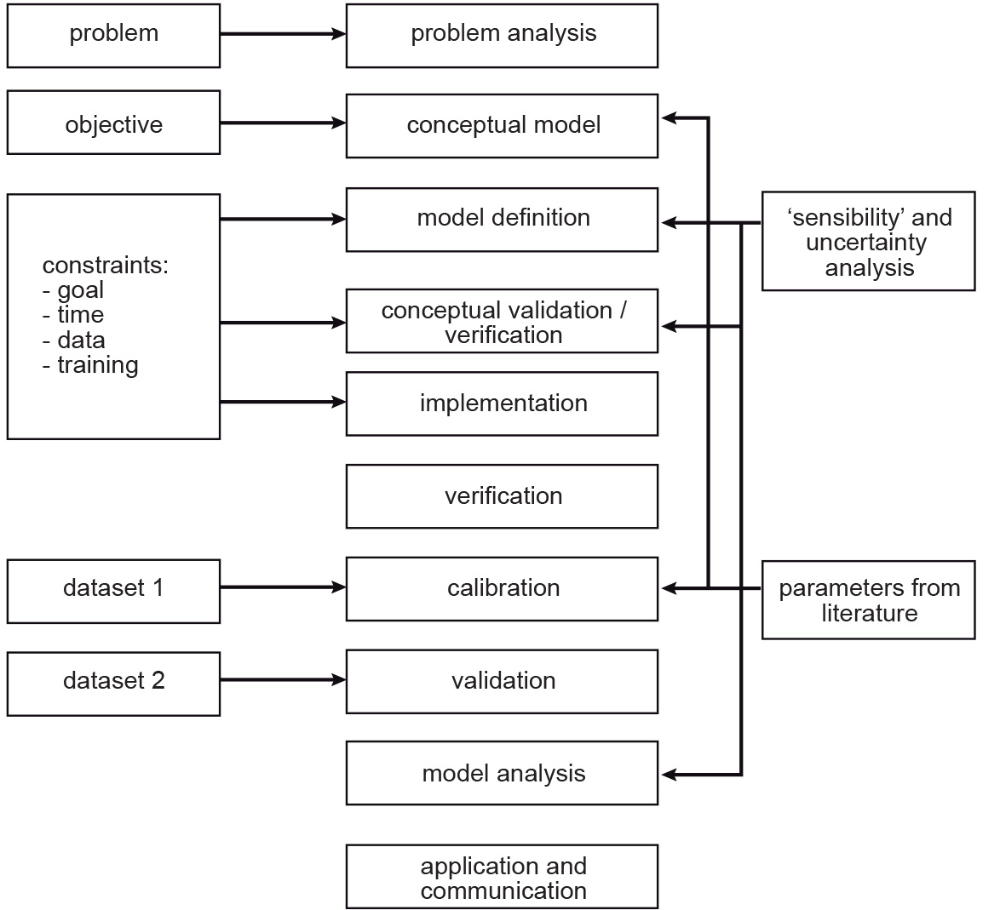

Systems and Models
==================
[WHAT IS THE CORRECT TITLE OF THIS EXERCISE?]

In this seccion, you will get familiar with some of the basic concept of |ltb| `Systems Modelling <Systems model_>`_. A |ltb| `System`_ is defined by Voinov [DO WE ADD A PROPER REFERENCE INSTEAD? DO WE ASSUME THAT THE REFERENCE TO ltb IS ENOUGH?] as *a combination of parts that interact and produce some new quality or function in their interaction.*

Systems
---------

A Systems consist of:

+ Parts or elements
+ Interaction between these elements
+ Emergent properties

.. attention:: 
   **Question.**
   Think about an example of a *system* and answer the following questions:

   + What are the **elements** in your example of a system?
   + Give some examples of **interactions** in such system and identify if the interactions are related to the *flow of material* or the *flow of information.*

|ltb| `Interactions <Interaction_>`_ between elements can have many different forms. Interactions may form loops. When :math:`A` impacts  :math:`B`, while at the same time :math:`B` impacts :math:`A`, we say that there is a |ltb| `feedback in the system <System feedback_>`_. We distinguish **positive** and **negative** feedback loops. 

An example of a *positive feedback* is population growth. The larger the population the more people are born, the more people are born the larger the population. In a *negative feedback* loop the system stabilises itself according to the rule: *the larger something is, the smaller something becomes.* For the population example, if there is a limited supply of food, and the population grows, there is less food for each individual. 

Task 
   The table below contains a few examples of *interactions*. Identify such interactions result in a positive or negative.

   +--------------------------------------------------------------------+---------------------+
   | Example                                                            |  Type of Feedback   |
   +====================================================================+=====================+
   | | The more we study, the more tired we get, and the more difficult |                     | 
   | | it is for us to understand the content of the course, therefore  |                     |
   | | the more we have to study because we learn less.                 |                     |
   +--------------------------------------------------------------------+---------------------+
   |  | The more sheep we have, the more wolves we get because they have|                     |
   |  | more food; the more wolves we get, the more sheep are eaten     |                     |
   |  | which means there is less food for each wolf and wolf           |                     |
   |  | population decreases.                                           |                     |
   +--------------------------------------------------------------------+---------------------+
   
Systems and their elements do not always change immediately as a reaction to internal or external influences. When the changes do not hapen immediatly, we referred to them as the *delayed effects*.

.. attention:: 
   **Question.**
   Can you think of an example of a delayed effect in a system?

Although thinking about the different elements and interactions of a system  may seem very abstract. Such activity provides the starting point for building models, and models help us to gain  understanding about the world we live in.

Models
-------

Modelling is a very “confusing” term. It can be used at different abstraction levels and it may refer to modelling different types of information or systems. Many things we do or products we produce can be regarded as a model. If we take a picture of a landscape this can be regarded as a model. A printed map is also a model. In the exercise on *Data Modelling*, you created a model of reality as a  point-vector layer, or a continuous raster. 

The models we refere in this section describe processes that happen on the Earth's surface at various scales. Such model aim to represent systems. Modelling the Earth as a system may require to capture its natural components, e.g. we could portrait the system Earth as the combination of four subsystems: *atmosphere (air), litho-sphere (land), hydrosphere (water) and biosphere (life)*. However, we may also model the Earth as human induced systems, such as *urbanisation, human health and agriculture.*

.. attention:: 
   **Question.**
   + Can you define a system that takes place on the Earth's surface, and it is interesting for studying during your MSc research project?. What makes such system relevant or interesting?

Besides the fact that we have different interests in system earth, we all study different sub-systems. There are also different ways to describe these models or implement these models in software. [THIS PARAGRAPH ADD VERY FEW TO THE EXERCISE, AND IT ADD MANY TERMS. REMOVE IT?]

Many modelling processes start with a conceptual |ltb| `Model`_. A conceptual model is often written on a piece of paper, but it can also be a mental picture of some phenomenon.

You can create a conceptual model by following these steps:

   + Define the goal (write it on the bottom of the page)
   + Describe the input of your model (write it on the top of the page)
   + Fill in all the steps (processes) needed to go from input (top) to goal (bottom)

Task 1  
   In many universities they teach conceptual modelling by asking the students to create a conceptual model for making a cup of tea or coffee. 
   Create your own conceptual model for making tea or coffee.

   [REMOVE THIS?] -> and upload a picture of your model in the discussion board.

A conceptual model serve as the first step towards creating such a computer model. A  conceptual model for making tea represents a non-spatial model. However, as a geo-scientist are interested in spatial and temporal models. You are also interested in implementing your model in a modelling software, using your spatial data.

When `modelling a system <System Modelling_>`_, the components of a conceptual model includes three elements: *boundaries, variables and parameters*. 

.. attention:: 
   **Question.**
   For the flowchart [WE NEVER ASK FOR A FLOWCHART, DO WE MEAN THE TEA-MODEL?] you created in the previous task.

   + Can you define the boundary of the model, a variable and a parameter? 
   + Is the variable you defined, a state variable?

Purpose of a Model 
--------------------
[THE TITLE IS MISLEADING. CHANGE TO 'CLASSIFYING MODELS'?]

Model are use in many application, and they can be classified in various ways. Here, we identify five ways of classifying models in  GIS-based applications based on their characteristics:

   + Purpose of the model
   + The methodology underlying the model
   + Scale
   + Dimensionality
   + Implementation logic

The *purpose* of the model refers to whether the model is **descriptive, prescriptive or predictive** in nature. The *methodology* underlying the model refers to its operational components. Here, we have two groups: **stochastic** models and **deterministic** models. Read about models according to *scale, dimensionality,* and *implementation logic* in  |ltb| `System Modelling`_.

.. attention:: 
   **Question.**
   
   + An example of a deterministic model could be the hydrological flow in a watershed. **Why do you think hydrological models are deterministic?**

   + When a model is stochastic, we normally run such model many times with the same input parameters, and present then present the average or a range of the modelling results. **Why is this necessary in stochastic models?**

Modelling Processes
------------------------------

The process of building models is more difficult than defining the elements of models and their relationships, capturing them in a conceptual model, and implementing  such conceptual model in a software, see :numref:`fig-modelling-process`  The |ltb| `Modelling`_ process in often described as being *iterative.* 

You see this for example in the pictures below taken from the Living Textbook:

.. _fig-modelling-process:

   A summary of the steps in the modeling process

Task 
   Define in your own words, why the modelling process is iterative? and what will induce you to make another iteration? or when would you stop iterating a model)?

Four  of the stemps in :numref:`fig-modelling-process` deserve some attention:

   + Verification
   + Calibration
   + Validation
   + Sensitivity analysis

**Verification**, in the context of computer simulation,  is the process of confirming that the conceptual model was correctly implemented. It may seem obvious that when you made the conceptual model you know how to implement it. Yet, a lot of things can go wrong, therfore we need verification.

**Calibration** is the process of adjustmenting of the model parameters. 
In the introduction [WAS THAT SHOWED IN THIS COURSE?] of this topic you watched the ITC evacuation model. 

Task 
   Give an example of a problem during the implementation of a model that can be detected during verification.

Task 
   Name at least one parameter that you would like to calibrate for this model. [WHICH MODEL? THE EVACUATION MODEL?]

When you look at the diagram you see that there is a line between calibration and model definition [NOT CLEAR IN THE DIAGRAM. MODIFY DIAGRAM?]. **Validation** is the most difficult task; validation is the  process of proving that the model is a good representation of reality. Many models are not fully validated. Note that the diagram  shows that calibration and validation use two different datasets.

.. attention:: 
   **Question.**
   Why it is a good idea to use different datasets for calibration and validation?

Task 
   Below you see a table with examples of models. Indicate if they are *static* or *dynamic*.

   ======================================    =======================
   Example                                   Static or Dynamic?
   ======================================    =======================
   An animated map                              \
   A film                                      \
   A simulation model                                 \
   The implementation of the tea model          \
   The evacuation model of ITC                   \
   ======================================    =======================

The **implementation logic** of a model refers to two groups of approaches: *deductive* approaches and *inductive* approaches. To explain the difference between those groups, we will use an example from education. The concepts 'deductive' and 'inductive' can also be applied to learning and teaching.  In a *deductive approach,* the teacher presents students a new concept, explains how it works, and then makes the students  to practice using the concept.
In an *inductive approach,* the teacher presents students many examples that show how the concept is used; the students should 'notice and realise', by way of the examples, how the concept works [CT22020]_.

.. [CT22020] Olenka Bilash. (2009, June). Best of Bilash. Improving second language education. Retrieved October 7, 2020, from https://bestofbilash.ualberta.ca/inductivedeductive.html

[TABLE page 9. WHAT DOES THE TABLE SHOW?]

.. attention:: 
   **Question.**
   When would prefer to use an inductive over an deductive approach? [DOES THIS QUESTION REQUIRE CLARIFICATION?]

   
